# ENS Decision Theory

> ENS'in atomunun (Decision, P1) teorisidir. Sonraki her kavram — Decision Entropy,
> Decision Gravity, Decision Capital — bu atomun *özellikleri* ya da *toplamları*
> üzerinedir; bu yüzden onlardan önce gelir. `canon: false` — Külliyat'a ancak skeptic
> incelemesinden sağ çıkınca girer.
>
> **v0.2 notu:** Bu sürüm [SKR-003](reviews/SKR-003-decision-theory.md)'e yanıttır. Üç
> talep karşılandı: (1) lifecycle Simon/Mintzberg'e kredilendi, (2) DMN/ADR karşısında
> konum eklendi, (3) en önemlisi — **individuation ölçütü** verildi: atom, deliberation
> değil, *commit-edilmiş karardır*. §Yanıt tablosu (sonda) her talebi eşler.

## Definition

ENS Decision Theory, **kararı bir organizasyonel nesne ve süreç olarak** tanımlar. Ama
kritik incelik şudur: **atom, herhangi bir düşünme (deliberation) değil, bir _commit-edilmiş
karardır_** (§Individuation). Bir karar; tek bir *amaca* (Purpose) yönelik, açık
*alternatifler* arasından, bir *bağlamda* (Context) yapılan ve **tek bir Commitment olayıyla
mühürlenen**, sonucu ölçülebilir bir taahhüttür. Kararı karardan yapan şey niyetlilik
(Purpose) ve karşı-olgusal yapıdır (Alternatives); onu *bireylenebilir* kılan şey ise
**taahhüt anıdır.**

## Motivation — neden atom karar?

Bir sistemin atomunu yanlış seçersen her şeyi yanlış ölçekte ölçersin. ERP atomu
**transaction** seçti; reasoning görünmez oldu. ENS atomu **decision** seçer; reasoning,
memory ve learning birer birinci-sınıf nesne olur. Transaction kararın izidir; document
kanıtı; process ise kararların dizisidir. Atom, üzerine anlam yüklenebilen en küçük
birimdir — organizasyonda anlamın taşıyıcısı karardır.

## Prior art ve konumlandırma

ENS'in kararı merkeze alması özgün değildir; dürüstçe konumlanmalı (Anayasa Madde VI):

| Öncül | Ne verdi | ENS ile örtüşme | ENS'in delta'sı |
|-------|----------|-----------------|-----------------|
| **Simon (1960)** | Karar süreci: intelligence → design → choice | Lifecycle'ın ilk üç fazı | Döngüyü **kapatmaz**; ENS Measurement→Learning→Memory ekler |
| **Mintzberg vd. (1976)** | identification → development → selection; kararların sınırlanamazlığı | Lifecycle + individuation kaygısı | ENS, sınırı **commitment**'a taşıyarak bireylemeyi çözer (§Individuation) |
| **Klasik decision theory** (vN-M, Savage) | Belirsizlik altında optimal *seçim hesabı* | `Alternatives`/`Confidence` içeriğini üretmede araç | ENS konusu seçim hesabı değil, kararın *ontolojisi* |
| **DMN / Decision Management Manifesto (OMG)** | "Kararlar birinci-sınıf nesnelerdir"; DRD, decision table, XML şema | Kararı standart nesne yapma | DMN *tekrarlanabilir, kural-tabanlı* kararları modeller; memory-of-why, outcome, learning **yok** |
| **ADR (Nygard)** | Bir domaindeki kararın *neden*'inin kaydı | Purpose/Context/Alternatives kaydı | ENS bunu tüm karar sınıflarına geneller + outcome/learning/memory ekler |

**Delta özeti:** ENS bir *seçim hesabı* (klasik DT) ya da *kural motoru* (DMN) değildir.
Ayırt edici çekirdek üç şeydir: (a) kararın **commitment ile bireylenmesi**, (b)
**Expected/Actual + Learning** ile döngünün kapatılması, (c) explainability'nin **invariant**
oluşu. Bunlar mevcut standartlarda yoktur.

## Theoretical model

### 1. Individuation — atom nasıl sınırlanır (en kritik)
Mintzberg (1976) haklıdır: *deliberation* süreçleri kesintili, döngüsel ve sınırsızdır.
Ama ENS atomu deliberation değildir. **Atom, bir _Commitment olayıyla_ mühürlenen karardır.**
Bir karar, ancak ve ancak şu dört koşulu sağladığında bireylenir:

1. **Tek Owner** — sorumluluğun bağlandığı bir insan (P7).
2. **Tek Purpose** — çözülen tek bir niyet.
3. **Açık Alternatives** — aralarından seçilen, kayıtlı karşı-olgular.
4. **Tek Commitment olayı** — reasoning'in durup enactment'ın başladığı, sonucu ölçülebilir
   kılan ayrık an.

Deliberation sürekli ve bulanıktır; **commitment ayrıktır** — sorumluluğun iliştiği edimdir.
ENS kararı, bulanık deliberation sınırında değil, **keskin commitment sınırında** bireyler.
Böylece Mintzberg'in itirazı aşılır: o *süreçlerin* sınırsızlığını gösterdi; ENS *taahhütlerin*
ayrıklığından yararlanır.

**Kapsam sonuçları (dürüst sınır):**
- Hiç commit edilmeyen, örtük "kararlar" ENS atomu **değildir**; context olarak yakalanabilir
  ama atom sayılmaz. Bu bir eksiklik değil, kasıtlı kapsamdır (ENS-1000 §VII ile tutarlı).
- Commit edilmiş ama sonucu atfedilemeyen kararlarda ENS *learning* iddia etmez; memory +
  explainability sağlar.
- **Nicel yapının temeli budur:** Decision Graph düğümleri = commitment'lardır (ayrık,
  sayılabilir). Böylece Decision Entropy/Gravity/Capital (R1) tanımlı bir küme üzerinde ölçülür.

### 2. Decision Object — anatomi
Commit-edilmiş karar, on iki alanlı bir nesnedir (sözlük ENS-4000 ile tutarlı):

| Alan | Rolü | İlke |
|------|------|------|
| Purpose | Niyet; kararın *neden* verildiği | P1 |
| Context | Kararın bağlandığı ilgili durum | P2 |
| Alternatives | Değerlendirilen karşı-olgusal seçenekler | P1 |
| Evidence | Alternatifleri destekleyen/çürüten kanıt | P2, P6 |
| Assumptions | Doğru varsayılan, kırılabilir öncüller | P6 |
| Risks | Öngörülen olumsuz sonuçlar | P6 |
| Owner | Sorumlu insan | P7 |
| Confidence | Niyete ulaşma kalibre olasılığı | P6 |
| Expected Outcome | Beklenen sonuç (öngörü) | P4 |
| Actual Outcome | Ölçülen gerçek sonuç | P4 |
| Learning | Beklenen ile gerçek arasındaki fark ve çıkarım | P4 |
| Memory Links | Bağlı önceki/sonraki kararlar | P3 |

`Expected` ile `Actual`'ın ayrı olması learning'in (P4) kaynağıdır; `Alternatives`'in zorunlu
olması karşı-olgu olmadan sonucun atfedilememesindendir (ENS-1000 §VII).

### 3. Decision Lifecycle — Simon + Mintzberg + kapanış
Karar bir satır değil, bir olay geçmişidir (event-sourced). İlk üç faz Simon'ın
intelligence/design/choice'unun (ve Mintzberg'in identification/development/selection'ının)
yeniden ifadesidir; **ENS'in kattığı, Commitment sonrası kapanıştır** (Measurement → Learning
→ Memory) — ki Simon ve Mintzberg bunu içermez:

```mermaid
stateDiagram-v2
    [*] --> Framing: Purpose belirir  (Simon: intelligence)
    Framing --> Contextualization: Context toplanır (P2)
    Contextualization --> Reasoning: Alternatives+Evidence+Confidence (Simon: design)
    Reasoning --> Commitment: Owner mühürler (Simon: choice; P7) ← ATOM SINIRI
    Commitment --> Enactment: karar dünyaya çıkar
    Enactment --> Measurement: Actual Outcome ölçülür (P4)  ← ENS deltası
    Measurement --> Learning: Expected vs Actual              ← ENS deltası
    Learning --> Memory: Company Memory'ye yazılır (P3)       ← ENS deltası
    Memory --> [*]
    Memory --> Framing: sonraki kararı besler (Memory Links)
```

`Commitment` olayı hem atom sınırını (§Individuation) hem Simon'ın "choice" anını işaretler.

### 4. Özyineleme (recursion)
Karar, organizasyonel akıl yürütme düzeyindeki atomdur — mutlak bölünmez değil. Büyük bir
karar alt kararlara ayrışır ve **her alt kararın kendi Commitment'ı vardır** (Beer'in
özyinelemeli sistemleri gibi). Atom, seçilen düzeye görelidir; o düzeyde commitment birimdir.

## Implications
- **Decision Graph düğümleri commitment'lardır** — ayrık ve sayılabilir; nicel yasaların
  zemini.
- Her şey kararlara atıfta bulunur: audit = commitment geçmişi; memory = karar belleği
  (*neden*); Enterprise IQ = karar kalitesinin toplamı.
- **Explainability yapısaldır** (P6): açıklama Evidence/Assumptions/Confidence'tan türer.

## Relationships
- **→ Context Theory (P2):** Context kararın alanıdır; kalitesi kararı sınırlar (LAW-CONTEXT).
- **→ Company Memory (P3):** Memory Links kararı geçmiş/geleceğe bağlar; *neden*'i saklar.
- **→ Learning (P4):** Expected/Actual farkı; yalnızca atfedilebilir kararlarda tanımlı.
- **→ Decision Entropy/Gravity/Capital:** commitment kümesi üzerine özellikler; bu yüzden
  Decision Theory önce gelir (R1 buradan çözülür).

## Examples
**Atfedilebilir (fiyatlandırma):** Purpose = marjı koru; Alternatives = {%5, %0, %8};
Commitment = fiyat listesinin onay olayı (atom sınırı); Confidence = 0.7; Expected = hacim
−%3; Actual = −%2; Learning = elastikiyet yüksek tahmin edilmiş. Tam döngü.

**Zayıf-atfedilebilir (yeniden yapılanma):** commit edilir (atom vardır) ama sonuç
confounding'e karışır; ENS learning iddia etmez, memory+explainability sağlar.

**Atom-olmayan (koridor kararı):** hiç commit edilmeyen örtük bir eğilim — ENS atomu değil;
context sinyali olarak kayda geçebilir, düğüm olmaz.

## Laws
Decision Theory, `3000-laws/` yasalarının zeminidir. Yasalar commitment kümesi üzerinde
ifade edilir; bu küme tanımlı olduğu için (§Individuation) yasalar ölçülebilir hale gelir.

## Failure conditions (Anayasa Madde X)
- **Örtük karar kapsamı.** Individuation commitment'a dayandığından, hiç commit edilmeyen
  kararlar kapsam dışıdır. Eğer örgütsel değerin çoğu commit-edilmemiş kararlarda yatıyorsa,
  ENS atomu değerin azınlığını yakalar. (Kasıtlı ama sınırlayıcı bir kapsam.)
- **Kademeli commitment.** Bazı taahhütler tek bir anda değil, kademeli olgunlaşır;
  Commitment olayının anı belirsizleşebilir. Deliberation bulanıklığından *daha nadir* ama
  sıfır değil; işlevsel bir "mühür" tanımı (ör. geri-dönülemezliğin başladığı an) gerekir.
- **Overhead (P5).** On iki alanlı nesne, düşük-stake commitment'lar için pahalı olabilir;
  alan derinliği Decision Gravity'ye (stake) göre ölçeklenmeli — her commitment tam nesne
  taşımaz.

## SKR-003'e yanıt
| Talep | Karşılandığı yer |
|-------|------------------|
| 1. Lifecycle'ı Simon/Mintzberg'e kredile | §Prior art tablosu, §Model 3 (fazlar etiketli) |
| 2. DMN/ADR karşısında konumlan | §Prior art tablosu (DMN, ADR satırları + delta) |
| 3. Individuation ölçütü ver | §Model 1 (commitment-mühürlü, 4 koşul) |

---

*Deliberation bulanıktır; commitment keskindir. ENS kararı, düşünmenin değil, taahhüdün
sınırında bireyler — ve atomu ancak öyle sayılabilir, ölçülebilir ve öğrenilebilir olur.*
