# ENS Decision Theory

> ENS'in atomunun (Decision, P1) teorisidir. Sonraki her kavram — Decision Entropy,
> Decision Gravity, Decision Capital — bu atomun *özellikleri* ya da *toplamları*
> üzerinedir; bu yüzden onlardan önce gelir. `canon: false` — Külliyat'a ancak skeptic
> incelemesinden sağ çıkınca girer.
>
> **v0.2 notu:** Bu sürüm [SKR-003](reviews/SKR-003-decision-theory.md)'e yanıttır. Üç
> talep karşılandı: (1) lifecycle Simon/Mintzberg'e kredilendi, (2) DMN/ADR karşısında
> konum eklendi, (3) en önemlisi — **individuation ölçütü** verildi: atom, deliberation
> değil, *commit-edilmiş karardır*. §Yanıt tablosu (sonda) her talebi eşler.
>
> **v0.3 notu (OL1/OE1 — additive revizyon):** Decision Object'e iki alan eklendi:
> (OL1) Alternative-başına **ExpectedValue** (Reasoning fazında, tüm Alternative'ler için;
> [ENS-3022](../3000-laws/ENS-3022-decision-gravity.md)'nin `Stake = spread(ExpectedValue)`
> ihtiyacını ve [ENS-2004](ENS-2004-learning-theory.md) §5(ii) seçim-rasyonalitesini karşılar)
> ve (OE1) **intent** (`exploit | explore`, Commitment anında, sonuçtan önce;
> [ENS-3021](../3000-laws/ENS-3021-decision-entropy.md) §Model 3'ün istediği ölçüm-filtresi).
> Bu, v0.2 çekirdeğinin ratified iddialarını değiştirmez; yalnızca genişletir — ama additive
> olsa da **yeni bir skeptic turu gerektirir** (`status: review`; G2/G3 gereği yazar kendi
> eklemesini onaylayamaz). İki alan da ENS-3021/3022'nin ENS-2001'e olan **kırık cross-doc
> bağımlılığını** kapatır (o yasalar bu alanları varsayıyordu ama alanlar burada yoktu).
> §"v0.3 additive alanlar (OL1/OE1)" tablosu (sonda) her alanı kaynağına eşler.

## Definition

ENS Decision Theory, **kararı bir organizasyonel nesne ve süreç olarak** tanımlar. Ama
kritik incelik şudur: **atom, herhangi bir düşünme (deliberation) değil, bir _commit-edilmiş
karardır_** (§Individuation). Bir karar; tek bir *amaca* (Purpose) yönelik, açık
*alternatifler* arasından, bir *bağlamda* (Context) yapılan ve **tek bir Commitment olayıyla
mühürlenen**, sonucu ölçülebilir bir taahhüttür. Kararı karardan yapan şey niyetlilik
(Purpose) ve karşı-olgusal yapıdır (Alternatives); onu *bireylenebilir* kılan şey ise
**taahhüt anıdır.**

## Motivation — neden atom karar?

Bir sistemin atomunu yanlış seçersen her şeyi yanlış ölçekte ölçersin. ERP atomu
**transaction** seçti; reasoning görünmez oldu. ENS atomu **decision** seçer; reasoning,
memory ve learning birer birinci-sınıf nesne olur. Transaction kararın izidir; document
kanıtı; process ise kararların dizisidir. Atom, üzerine anlam yüklenebilen en küçük
birimdir — organizasyonda anlamın taşıyıcısı karardır.

## Prior art ve konumlandırma

ENS'in kararı merkeze alması özgün değildir; dürüstçe konumlanmalı (Anayasa Madde VI):

| Öncül | Ne verdi | ENS ile örtüşme | ENS'in delta'sı |
|-------|----------|-----------------|-----------------|
| **Simon (1960)** | Karar süreci: intelligence → design → choice | Lifecycle'ın ilk üç fazı | Döngüyü **kapatmaz**; ENS Measurement→Learning→Memory ekler |
| **Mintzberg vd. (1976)** | identification → development → selection; kararların sınırlanamazlığı | Lifecycle + individuation kaygısı | ENS, sınırı **commitment**'a taşıyarak bireylemeyi çözer (§Individuation) |
| **Klasik decision theory** (vN-M, Savage) | Belirsizlik altında optimal *seçim hesabı*; **expected value** kavramı | `Alternatives`/`Confidence` içeriğini + **Alternative-başına ExpectedValue**'yu (OL1) üretmede araç | ENS konusu seçim hesabı değil, kararın *ontolojisi*; EV'yi *hesaplamaz*, karşılaştırılabilir tahmin olarak *saklar* (stake + seçim rasyonalitesi için) |
| **March (1991) exploration/exploitation** | Örgütsel öğrenmede kasıtlı keşif ile mevcut bilgiyi işletme arasındaki gerilim | `intent: exploit\|explore` alanının (OE1) kavramsal kaynağı | ENS bunu bir *karar alanı* yapar (commitment-anı, sonuçtan bağımsız); istenmeyen tutarsızlığı korunması gereken keşiften ayırır (ENS-3021 §Model 3) |
| **DMN / Decision Management Manifesto (OMG)** | "Kararlar birinci-sınıf nesnelerdir"; DRD, decision table, XML şema | Kararı standart nesne yapma | DMN *tekrarlanabilir, kural-tabanlı* kararları modeller; memory-of-why, outcome, learning **yok** |
| **ADR (Nygard)** | Bir domaindeki kararın *neden*'inin kaydı | Purpose/Context/Alternatives kaydı | ENS bunu tüm karar sınıflarına geneller + outcome/learning/memory ekler |

**Delta özeti:** ENS bir *seçim hesabı* (klasik DT) ya da *kural motoru* (DMN) değildir.
Ayırt edici çekirdek üç şeydir: (a) kararın **commitment ile bireylenmesi**, (b)
**Expected/Actual + Learning** ile döngünün kapatılması, (c) explainability'nin **invariant**
oluşu. Bunlar mevcut standartlarda yoktur.

## Theoretical model

### 1. Individuation — atom nasıl sınırlanır (en kritik)
Mintzberg (1976) haklıdır: *deliberation* süreçleri kesintili, döngüsel ve sınırsızdır.
Ama ENS atomu deliberation değildir. **Atom, bir _Commitment olayıyla_ mühürlenen karardır.**
Bir karar, ancak ve ancak şu dört koşulu sağladığında bireylenir:

1. **Tek Owner** — sorumluluğun bağlandığı bir insan (P7).
2. **Tek Purpose** — çözülen tek bir niyet.
3. **Açık Alternatives** — aralarından seçilen, kayıtlı karşı-olgular.
4. **Tek Commitment olayı** — reasoning'in durup enactment'ın başladığı, sonucu ölçülebilir
   kılan ayrık an.

Deliberation sürekli ve bulanıktır; **commitment ayrıktır** — sorumluluğun iliştiği edimdir.
ENS kararı, bulanık deliberation sınırında değil, **keskin commitment sınırında** bireyler.
Böylece Mintzberg'in itirazı aşılır: o *süreçlerin* sınırsızlığını gösterdi; ENS *taahhütlerin*
ayrıklığından yararlanır.

**Kapsam sonuçları (dürüst sınır):**
- Hiç commit edilmeyen, örtük "kararlar" ENS atomu **değildir**; context olarak yakalanabilir
  ama atom sayılmaz. Bu bir eksiklik değil, kasıtlı kapsamdır (ENS-1000 §VII ile tutarlı).
- Commit edilmiş ama sonucu atfedilemeyen kararlarda ENS *learning* iddia etmez; memory +
  explainability sağlar.
- **Nicel yapının temeli budur:** Decision Graph düğümleri = commitment'lardır (ayrık,
  sayılabilir). Böylece Decision Entropy/Gravity/Capital (R1) tanımlı bir küme üzerinde ölçülür.

**v0.3 alanları individuation'ı bozmaz (OL1/OE1 kontrolü).** İki eklenen alan da yeni bir
atom-sınırı yaratmaz, dolayısıyla commitment kümesinin sayılabilirliğini korur:
- **ExpectedValue** koşul-3'ün (*Açık Alternatives*) içindedir — her Alternative'i *niceler*,
  yeni bir Alternative ya da yeni bir karar üretmez. Karşı-olguları zenginleştirir, çoğaltmaz.
- **intent** koşul-4'ün (*tek Commitment olayı*) üzerine basılan bir etikettir — commitment
  anında konur, ayrı bir commitment doğurmaz. `explore` etiketi kararı "yarım" ya da "geçici"
  yapmaz; tek, mühürlü, sayılabilir bir atom olmayı sürdürür (yalnızca istenmeyen-tutarsızlık
  ölçümünden [ENS-3021] hariç tutulur — bu bir *ölçüm filtresidir*, individuation değil).

Yani atom sayısı iki alandan da etkilenmez; her ikisi de mevcut dört koşulun *içeriğini*
doldurur, koşul kümesini değiştirmez.

### 2. Decision Object — anatomi
Commit-edilmiş karar, **on üç alanlı** bir nesnedir (v0.3; sözlük ENS-4000 ile tutarlı).
`Alternatives` artık *yapısaldır*: her seçenek bir `ExpectedValue` taşır (OL1).

| Alan | Rolü | İlke |
|------|------|------|
| Purpose | Niyet; kararın *neden* verildiği | P1 |
| Context | Kararın bağlandığı ilgili durum | P2 |
| Alternatives | Değerlendirilen karşı-olgusal seçenekler; **her biri bir ExpectedValue taşır** (aşağı) | P1 |
| Evidence | Alternatifleri destekleyen/çürüten kanıt | P2, P6 |
| Assumptions | Doğru varsayılan, kırılabilir öncüller | P6 |
| Risks | Öngörülen olumsuz sonuçlar | P6 |
| Owner | Sorumlu insan | P7 |
| Confidence | Niyete ulaşma kalibre olasılığı | P6 |
| Expected Outcome | *Seçilen* Alternative'in beklenen sonucu (öngörü) | P4 |
| Actual Outcome | Ölçülen gerçek sonuç | P4 |
| Learning | Beklenen ile gerçek arasındaki fark ve çıkarım | P4 |
| Memory Links | Bağlı önceki/sonraki kararlar | P3 |
| **intent** | Commitment anında konan `exploit \| explore` etiketi (OE1) | P4, P1 |

**ExpectedValue (per-Alternative alt-alanı, OL1).** `Alternatives` listesindeki her seçenek
`aᵢ`, sonuçtan bağımsız bir `ExpectedValue(aᵢ)` taşır — kararın *kendi*, commitment-anındaki
beklenen değer/etki tahmini, ortak (Purpose-tipi içi kıyaslanabilir) bir ölçekte. İki tüketicisi
vardır:
- **ENS-3022 Stake:** `Stake(d) = spread(ExpectedValue(aᵢ))` — Alternative'ler arası EV yayılımı
  (ör. max−min ya da std). Seçenekler benzer değerdeyse stake düşük; genişçe ıraksıyorsa yüksek.
- **ENS-2004 §5(ii) seçim rasyonalitesi:** seçilen Alternative, kararın kendi EV sıralamasında en
  yükseği miydi? Bu, *sonucu bilmeden* yalnızca Decision Object'ten hesaplanır (donmuş snapshot).

`ExpectedValue` ile `Expected Outcome` **ayrıdır ve gereksiz tekrar değildir:** `ExpectedValue`
*tüm* Alternative'ler için karşılaştırılabilir bir skalerdir (sıralama + spread için); `Expected
Outcome` ise yalnızca *seçilen* Alternative'in daha zengin öngörüsüdür (Actual Outcome'a karşı
öğrenme için — `Learning` alanı; ENS-2004). İlki karşılaştırma/stake, ikincisi outcome-öğrenimi
zeminidir.

`Expected` ile `Actual`'ın ayrı olması learning'in (P4) kaynağıdır; `Alternatives`'in zorunlu
olması karşı-olgu olmadan sonucun atfedilememesindendir (ENS-1000 §VII); `ExpectedValue`'nun
zorunlu olması ise stake ve seçim-rasyonalitesinin karşı-olgusuz ölçülememesindendir.

### 3. Decision Lifecycle — Simon + Mintzberg + kapanış
Karar bir satır değil, bir olay geçmişidir (event-sourced). İlk üç faz Simon'ın
intelligence/design/choice'unun (ve Mintzberg'in identification/development/selection'ının)
yeniden ifadesidir; **ENS'in kattığı, Commitment sonrası kapanıştır** (Measurement → Learning
→ Memory) — ki Simon ve Mintzberg bunu içermez:

```mermaid
stateDiagram-v2
    [*] --> Framing: Purpose belirir  (Simon: intelligence)
    Framing --> Contextualization: Context toplanır (P2)
    Contextualization --> Reasoning: Alternatives+Evidence+Confidence+ExpectedValue(tüm aᵢ) (Simon: design)
    Reasoning --> Commitment: Owner mühürler + intent(exploit/explore) konur (Simon: choice; P7) ← ATOM SINIRI
    Commitment --> Enactment: karar dünyaya çıkar
    Enactment --> Measurement: Actual Outcome ölçülür (P4)  ← ENS deltası
    Measurement --> Learning: Expected vs Actual              ← ENS deltası
    Learning --> Memory: Company Memory'ye yazılır (P3)       ← ENS deltası
    Memory --> [*]
    Memory --> Framing: sonraki kararı besler (Memory Links)
```

`Commitment` olayı hem atom sınırını (§Individuation) hem Simon'ın "choice" anını işaretler.

**v0.3 alanlarının faz-yerleşimi (OL1/OE1):**
- **ExpectedValue → Reasoning fazı, _tüm_ Alternative'ler için.** Yalnızca seçilen için değil,
  çünkü her iki tüketici de tüm seçenekleri ister: `spread(ExpectedValue)` (ENS-3022 Stake) EV
  yayılımını, seçim rasyonalitesi (ENS-2004 §5ii) ise seçilenin sıralamadaki yerini gerektirir.
  EV'ler, deliberation'ın Alternative-değerlendirme çıktısıdır; Commitment'ta **donar** (ENS-2004
  §5 hindsight koruması — sonuç bilgisinden bağımsız kalırlar).
- **intent → Commitment fazı (sonuçtan önce, event-sourced).** Etiket, mühür anında konur;
  Enactment'tan ve dolayısıyla Actual Outcome'dan önce yazılır. Bu sıralama kritiktir: kötü bir
  sonucu *post-hoc* "keşifti" diye etiketlemek event-sourcing'le imkânsızlaşır (ENS-3021 §Model 3).
  intent, Reasoning fazında değil Commitment'ta konur çünkü keşif/işletme ayrımı deliberation'ın
  değil, *taahhüdün* niteliğidir — Owner neyi mühürlediğini beyan eder.

### 4. Özyineleme (recursion)
Karar, organizasyonel akıl yürütme düzeyindeki atomdur — mutlak bölünmez değil. Büyük bir
karar alt kararlara ayrışır ve **her alt kararın kendi Commitment'ı vardır** (Beer'in
özyinelemeli sistemleri gibi). Atom, seçilen düzeye görelidir; o düzeyde commitment birimdir.

## Implications
- **Decision Graph düğümleri commitment'lardır** — ayrık ve sayılabilir; nicel yasaların
  zemini.
- Her şey kararlara atıfta bulunur: audit = commitment geçmişi; memory = karar belleği
  (*neden*); Enterprise IQ = karar kalitesinin toplamı.
- **Explainability yapısaldır** (P6): açıklama Evidence/Assumptions/Confidence'tan türer.

## Relationships
- **→ Context Theory (P2):** Context kararın alanıdır; kalitesi kararı sınırlar (LAW-CONTEXT).
- **→ Company Memory (P3):** Memory Links kararı geçmiş/geleceğe bağlar; *neden*'i saklar.
- **→ Learning (P4):** Expected/Actual farkı; yalnızca atfedilebilir kararlarda tanımlı.
- **→ Decision Entropy/Gravity/Capital:** commitment kümesi üzerine özellikler; bu yüzden
  Decision Theory önce gelir (R1 buradan çözülür).
- **→ Decision Gravity (ENS-3022):** `Stake = spread(ExpectedValue(aᵢ))` — OL1 alanı bu
  yasanın stake terimini besler; alan olmadan Stake kabaydı (ENS-3022 §Failure).
- **→ Decision Entropy (ENS-3021):** Decision Entropy yalnızca `intent=exploit` kararlar
  üzerinden ölçülür; OE1 alanı bu ölçüm-filtresini mümkün kılar (ENS-3021 §Model 3).
- **→ Learning (ENS-2004 §5ii):** seçim rasyonalitesi, Alternative-başına ExpectedValue'yu
  (OL1) donmuş snapshot'tan okur — sonuçtan bağımsız karar-kalitesi bileşeni.

## Examples
**Atfedilebilir (fiyatlandırma):** Purpose = marjı koru; Alternatives = {%5, %0, %8};
Commitment = fiyat listesinin onay olayı (atom sınırı); Confidence = 0.7; Expected = hacim
−%3; Actual = −%2; Learning = elastikiyet yüksek tahmin edilmiş. Tam döngü.

**Zayıf-atfedilebilir (yeniden yapılanma):** commit edilir (atom vardır) ama sonuç
confounding'e karışır; ENS learning iddia etmez, memory+explainability sağlar.

**Atom-olmayan (koridor kararı):** hiç commit edilmeyen örtük bir eğilim — ENS atomu değil;
context sinyali olarak kayda geçebilir, düğüm olmaz.

## Laws
Decision Theory, `3000-laws/` yasalarının zeminidir. Yasalar commitment kümesi üzerinde
ifade edilir; bu küme tanımlı olduğu için (§Individuation) yasalar ölçülebilir hale gelir.

## Failure conditions (Anayasa Madde X)
- **Örtük karar kapsamı.** Individuation commitment'a dayandığından, hiç commit edilmeyen
  kararlar kapsam dışıdır. Eğer örgütsel değerin çoğu commit-edilmemiş kararlarda yatıyorsa,
  ENS atomu değerin azınlığını yakalar. (Kasıtlı ama sınırlayıcı bir kapsam.)
- **Kademeli commitment.** Bazı taahhütler tek bir anda değil, kademeli olgunlaşır;
  Commitment olayının anı belirsizleşebilir. Deliberation bulanıklığından *daha nadir* ama
  sıfır değil; işlevsel bir "mühür" tanımı (ör. geri-dönülemezliğin başladığı an) gerekir.
- **Overhead (P5).** On üç alanlı nesne, düşük-stake commitment'lar için pahalı olabilir;
  alan derinliği Decision Gravity'ye (stake) göre ölçeklenmeli — her commitment tam nesne
  taşımaz.
- **ExpectedValue elicitasyonu (OL1, en ciddi yeni koşul).** Alternative-başına EV, *seçilmeyen*
  seçenekler için de değer tahmini ister; bu tahminler kaydedilmez ya da kabaysa hem `Stake`
  (ENS-3022) hem seçim rasyonalitesi (ENS-2004 §5ii) bozulur. Dahası EV, yüksek-belirsizlikli
  kararlarda tam da en zor kestirilen şeydir — döngüsel bir zorluk (belirsizlik hem stake'i
  büyütür hem EV'yi güvenilmez kılar). Bu, ENS-2004 ve ENS-3022'nin aynı yöndeki failure
  koşullarıyla tutarlıdır; ENS bunu çözmez, dürüstçe işaretler.
- **ExpectedValue ölçek/kıyaslanabilirlik (OL1).** `spread(EV)` ancak EV'ler ortak bir ölçekte
  ise anlamlıdır; parasal/itibari/stratejik değeri tek eksene indirmek her zaman meşru değildir.
  ENS-3022 bunu Purpose-tipi içi normalizasyonla hafifletir ama tip-içinde bile heterojen değer
  boyutları spread'i belirsizleştirebilir — çok-boyutlu değerde tek skaler EV bir *sadeleştirmedir*.
- **intent oyunlanması ve ikili sınır (OE1).** (a) Etiket commitment'ta konsa da bir Owner rutin
  kararları sistematik `explore` etiketleyip Decision Entropy ölçümünden kaçabilir — etiketleme
  oranı denetlenmeli (ENS-3021 §Failure ile aynı borç, burada da dürüstçe taşınır). (b) `exploit |
  explore` ikili bir etikettir; oysa bir karar kısmen işletme kısmen keşif olabilir — ikili etiket
  bu karışımı kaybeder. Bunun için işlevsel bir kural gerekir (baskın niyet, ya da alt-kararlara
  ayırma — §Özyineleme), aksi hâlde sınır bazı kararlarda zorlanır.

## SKR-003'e yanıt
| Talep | Karşılandığı yer |
|-------|------------------|
| 1. Lifecycle'ı Simon/Mintzberg'e kredile | §Prior art tablosu, §Model 3 (fazlar etiketli) |
| 2. DMN/ADR karşısında konumlan | §Prior art tablosu (DMN, ADR satırları + delta) |
| 3. Individuation ölçütü ver | §Model 1 (commitment-mühürlü, 4 koşul) |

## v0.3 additive alanlar (OL1/OE1)
| Alan | Kaynak talep | Faz | Tüketici | Belgedeki yer |
|------|--------------|-----|----------|----------------|
| **ExpectedValue** (per-Alternative) | OL1 — SKR-010 / ENS-2004 §5(ii); ENS-3022 `Stake=spread(EV)` | Reasoning (tüm Alternative'ler) | ENS-3022 (Stake), ENS-2004 §5ii (seçim rasyonalitesi) | §Model 2 (anatomi + alt-alan), §Model 3 (faz), §Relationships, §Failure |
| **intent** (`exploit\|explore`) | OE1 — SKR-011/012 / ENS-3021 §Model 3 | Commitment (sonuçtan önce, event-sourced) | ENS-3021 (Decision Entropy ölçüm-filtresi) | §Model 2 (anatomi), §Model 3 (faz), §Individuation (bozmaz), §Failure |

> Bu iki alan, ENS-3021/3022'nin ENS-2001'e olan **kırık cross-doc bağımlılığını** kapatır.
> **Sıradaki adım:** bağımsız `ens-skeptic` turu (v0.3 additive iddialar); survives → `ratified`
> geri döner. Yazar (ens-philosopher) kendi eklemesini onaylayamaz (G2/G3).

---

*Deliberation bulanıktır; commitment keskindir. ENS kararı, düşünmenin değil, taahhüdün
sınırında bireyler — ve atomu ancak öyle sayılabilir, ölçülebilir ve öğrenilebilir olur.*
