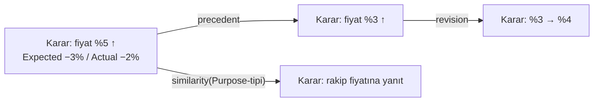

# ENS Company Memory

> P3'ün (Memory zekâ yaratır) teorisi ve ENS'in yapısal kilit taşı: Context Theory
> (ENS-2002) ilgililiği hesaplamak için buna bağımlı; Learning (P4) sonucu buraya yazar.
> `canon: false` — skeptic'ten sağ çıkınca Külliyat'a girer.
>
> **v0.2 notu:** [SKR-007](reviews/SKR-007-company-memory.md)'ye yanıt. (1) Purpose-tipi
> taksonomisi **Enterprise Ontology'ye** bağlanıp dairesellikten çıkarıldı, (2)
> survivorship bias'a **karşı-survivorship retention** mekanizması eklendi, (3) attribution
> borcu adlandırılmış bir kavrama — **ENS-2004 Learning Theory** — yükseltildi. §Yanıt tablosu
> sonda.
>
> **v0.3 notu (additive, skeptic bekliyor):** §3'ün taahhüt ettiği ama operasyonelleştirmediği
> iki ilkeye — **decay-not-delete** ve **memory-temelli confidence** (P6) — eksik mekanik katman
> eklendi: (a) §3a **confidence-conditioned salience decay** — sabit-kademe TTL yerine
> confidence'tan *sürekli* türeyen ve Purpose-tipi başına kalibre edilen bir sönüm hızı
> `λ(c)=λ_base·(1−c)^γ`; (b) `asserted_at` (değişmez ilk-keşif) vs `last_verified` (teyit)
> zamansal çaparı; (c) **stale = bayrak, aksiyon değil**; (d) §3b **Memory Curator** (yalnızca
> inceleme sinyali, otonom silme/mutasyon yok); (e) §Prior art'ta ECC/Hermes Curator/adaptive-
> decay-KG/TempValid/Temporal RAG'e dürüst atıf. **Yeni teorik yasa değil** — KG/RAG
> mühendisliğinin ENS invariant'larına bağlanmış sentezi (E1→E2). `status: ratified → review`:
> additive revizyon, yazar kendi işini onaylamaz (G2/G3); bağımsız `ens-skeptic` turu → `survives`
> ile `ratified`'a döner.
>
> **v0.3.1 notu (SKR-040 `wounded` yanıtı, bağımsız 2. tur bekliyor):** SKR-040 çekirdek tezi
> sağ bıraktı (math doğru, 5/5 prior-art gerçek); üç teori-kod desenkronu kapatıldı: **D1** —
> §Failure conditions'ın "7000 formülü henüz implemente etmemiştir" cümlesi **olgusal yanlıştı**
> (kod `DecayFunction.Rate`/`Salience`/`FindStale`/`Verify`'ı içeriyor); gerekçe "kodlanmadı"→
> "**kalibre edilmedi**" düzeltildi (E1 kalır). **D2** — §3a'da *saf tazelik* (`decayFactor = exp(−λΔt)`)
> ile *retrieval-sıralama bileşiği* (`Salience = RetentionPriority × decayFactor`) açıkça ayrıştırıldı;
> kod bu bileşiği hep döndürüyordu (Faz-4 orijinal tasarımı) — teori metni koda hizalandı, kod
> değişmedi (yalnızca yorumlar). **D3** — gerekçesiz `γ≥1` kısıtı **kaldırıldı**, `γ>0`'a
> (koddaki guard'la tutarlı) indirildi; pusula'nın 3 çapa-noktasının **hiçbir tek `γ` ile fit
> edilemediği** (endpoint γ≈0.72 vs orta γ≈2.04) dürüstçe §Failure conditions'a eklendi; savunma
> pusula-fit'e değil yalnızca yapısal argümana dayanır. **Öz-onay yok (G2/G3):** `survives` değil.
>
> **v0.4.0 notu — BREAKING (AUDIT-WAVE2-FIDELITY / D-5'e yanıt; bağımsız skeptic turu bekliyor).**
> Bağımsız bir sadakat denetimi, **iki skeptic turunun (SKR-040, SKR-041) da kaçırdığı** gerçek bir
> teori hatası buldu: v0.3'ün `λ(c) = λ_base·(1−c)^γ` sönümü ile §3'ün `retention ∝ |Learning|·c`
> ağırlığı **aynı sürücüyü — attribution confidence `c`'yi — iki kez sayıyordu.** §3a'nın "iki dik
> eksen" iddiası bu yüzden **yanlıştı**, ve sonuç kozmetik değildi: düşük-atıflı bir başarısızlık
> dersi hem düşük ağırlık alıyor **hem** hızlı sönüyordu — yani mekanizma, tam da korumak için
> tasarlandığı kaydı (karşı-survivorship, §3) sistematik olarak aşağı itiyordu. v0.4.0 üç şey yapar:
> (1) **sönümü confidence'tan koparır** ve ENS'in kendi v0.2 duruşuna + ENS-3023 §Model 2'ye geri
> döndürür — sönüm hızı artık **Purpose-tipinin context yarı-ömrüne** (`τ_π`) bağlıdır (`λ_π = ln2/τ_π`),
> `c`'ye değil; (2) `RetentionPriority`'yi §3'ün özgün tanımına (**saf `|Learning|`**) geri alır ve
> `c`'yi yalnızca *retrieval ağırlığında* (= ENS-3023 §Model 1 `value(d)`) bırakır; (3) patolojiyi
> "iddiayı yumuşatarak" değil **yapısal bir invariant'la** kapatır: §3'ün **karşı-survivorship tabanı**
> (kesilen her retrieval'da tipin en yüksek-`|Learning|` kaydı kümede kalmak zorundadır). `γ` ve
> `λ_base` **kaldırıldı** — kalibre edilecek tek serbestlik `τ_π`'dir ve o, bir uzmana doğrudan
> sorulabilir ("bu karar sınıfının context'i kaç günde yarı yarıya bayatlar?"). ENS-2004 §Implications
> da hizalandı (v0.3.3). Faz-4 kodu ve testleri güncellendi. **Öz-onay yok (G2/G3):** `survives` değil.

## Definition

**Company Memory, *neden*'in belleğidir — yalnızca *ne*'nin değil** (P3). Kalıcı, geri
getirilebilir bir kayıt: **commit-edilmiş kararların** (ENS-2001) Purpose'u, Context'i,
Alternatives'i, gerekçesi ve **ölçülmüş sonucu**, bir **Memory Graph** olarak. Veritabanı
*ne*'yi saklar (stok = 400); Company Memory *neden*'i ve *ne olduğunu* saklar.

## Motivation — neden *neden*?

P3: belleksiz organizasyon hatalarını tekrar eder. Bir kararın *neden*'i (Purpose, Context,
Alternatives, Assumptions) saklanmazsa, gelecekteki karar verici aynı akıl yürütmeyi — ve
aynı hatayı — sıfırdan üretir. *Neden*'in belleği, LAW-ORG-MEMORY'nin panzehridir.

## Historical context — ve konumlandırma

| Öncül | Ne verdi | ENS ile örtüşme | ENS'in (dar) delta'sı |
|-------|----------|-----------------|------------------------|
| **Walsh & Ungson (1991)** | Organizational memory; 5 retention bin | *Neden*'i saklama | Karar-merkezli (commit-edilmiş düğüm) + outcome/learning kapanışı |
| **CBR** (Aamodt & Plaza 1994; 4 RE) | retrieve-reuse-revise-retain; **case-base maintenance** (forgetting/silme dahil) | Benzer vaka getirme **ve forgetting** kısmen CBR'da | Dar delta: **salience sönümle, kaydı asla silme (audit)** + yapılı Decision Object + explainability invariant |
| **Nonaka & Takeuchi (1995)** | SECI, tacit/explicit | Bilgi dolaşımı | Bilgi yaratımı değil, **karar belleği** |
| **Argyris & Schön** | Single/double-loop öğrenme | Learning'in belleğe ihtiyacı | Double-loop'un *substratı* |
| **RAG / Vector DB** | Semantic retrieval mekaniği | Teknik erişim | Teori değil substrat |

**Dürüst delta:** "geçmiş kararı hatırla, benzerini getir, gerektiğinde unut" fikri özgün
değildir (CBR bunların hepsini içerir — case-base maintenance forgetting'i de). ENS'in dar,
gerçek katkısı: belleğin birimi **commit-edilmiş Decision Object**, geri getirme **outcome-
bağımsız Purpose-tipi** ile (§Model 2), unutma **kaydı silmeden salience sönümü** ile (§Model
3) ve retention **learning-önceliklidir** (§Model 3).

### Prior art — decay-not-delete (v0.3; v0.4.0'da bir bağlaması geri çekildi)
§3a/3b'nin sönüm mekaniği **ENS'in icadı değildir**; knowledge-graph/RAG mühendisliğinden
bilinçli bir sentezdir. Org-memory teorisi (Walsh & Ungson 1991; CBR/Aamodt & Plaza 1994) bu
somut *skorlu decay + TTL* mekanizmasını **içermez** — o, KG/RAG katmanının
katkısıdır. Dürüst konumlama (SKR-001 dersi: dar delta önden):

| Kaynak | Ne verdi | ENS'in kullanımı / delta |
|--------|----------|--------------------------|
| **ECC** (affaan-m/ECC, `continuous-learning-v2` skill; github.com/affaan-m/ECC) | confidence-skorlu fact'ler + decay + yeniden-doğrulama | `confidence`+`asserted_at`+`last_verified` alan deseninin kaynağı |
| **Hermes Curator** (Nous Research, hermes-agent.nousresearch.com) | inactivity-tetikli bellek curation | Curator kavramının kaynağı — ENS'te **yalnızca inceleme sinyaline** kısıtlandı (P7) |
| **Adaptive-decay-KG** ("Not All Memories Age the Same: Autodiscovery of Adaptive Decay in Knowledge Graphs", arXiv:2604.26970) | kategoriye-koşullu **non-uniform decay** | λ'nın **Purpose-tipi başına** kalibre edilmesi (§3a) — v0.4.0'da bu, sönümün **tek** sürücüsü |
| **TempValid** ("Confidence is not Timeless: Modeling Temporal Validity", ACL 2024, aclanthology.org/2024.acl-long.580.pdf) | öğrenilebilir confidence + decay | *v0.3'te* confidence→decay eşleşmesinin gerekçesi olarak kullanıldı; **v0.4.0'da bu kullanım geri çekildi** (aşağıdaki nota bakınız) |
| **Temporal RAG freshness** (arXiv:2509.19376) | freshness-class'a koşullu **kalibre olasılık** | sabit-kademe TTL yerine **sürekli** formun gerekçesi (v0.4.0'da korunur: `exp(−λ_π Δt)` süreklidir) |
| **Kalman (1960)** ("A New Approach to Linear Filtering and Prediction Problems", J. Basic Eng. 82(1)); **Åström & Wittenmark**, *Adaptive Control* (üstel unutma faktörlü RLS) | **ölçüm gürültüsü** ile **süreç gürültüsünün** ayrı yerlere girmesi | v0.4.0'ın çekirdek argümanı (§3a): `c` = ölçüm tarafı (başlangıç ağırlığı), `1/τ_π` = süreç tarafı (sönüm hızı) |
| **Concept drift** (Gama, Žliobaitė, Bifet, Pechenizkiy, Bouchachia 2014, "A Survey on Concept Drift Adaptation", ACM Comput. Surv. 46(4)) | bilgi eskimesinin sürücüsü **dağılım kayması**, gözlem kalitesi değil | sönümün Purpose-tipi **volatilitesine** bağlanmasının literatür karşılığı |

**Dürüst delta (dar) — v0.4.0'da bir bağlama geri çekildi.** Skorlu decay-not-delete yeni bir
mekanizma **değildir**; ENS'in katkısı bir mekanizma icadı değil, **üç bağlamadır**: (a) sönüm generic
KG-tipine değil **Purpose-tipi ontoloji sınıfına** koşulludur (§Model 2); (b) never-delete/audit
invariant'ı `asserted_at`/`last_verified` ayrımıyla **zorlanır**; (c) Curator otonom curation'a
karşı bir **inceleme sinyaline** kısıtlanır (P7).

> **Geri çekilen dördüncü bağlama (v0.4.0, dürüstçe).** v0.3 dördüncü bir katkı iddia ediyordu:
> *"sönüm confidence-süreklidir — pusula'nın (`D:\Dev\pusula\sema`) sabit-kademe (180/90/30 gün)
> confidence→TTL lookup'ını düzeltir."* Bu iddia **geri çekilmiştir.** Bulgu, pusula'nın kademelerinin
> *süreksiz* olması değil, **confidence→TTL eşlemesinin ENS için baştan uygunsuz olmasıdır**: ENS
> retrieval ağırlığını zaten `c` ile ölçekler (`value = |L|·c`), dolayısıyla aynı sürücüyü bir de
> sönüme koymak çift-sayımdır. Bu, **pusula hakkında değil ENS hakkında** bir bulgudur — retention
> ağırlığı taşımayan bir sistemde aynı eşleme çift-sayım üretmeyebilir. v0.3'ün TempValid'e dayandırdığı
> "confidence→decay eşleşmesi öğrenilmelidir" gerekçesi de bu nedenle **ENS'in kullanımından
> düşürülmüştür** (kaynağın kendisi hakkında bir iddia değil). Kalan üç bağlama ve *sürekli form*
> gerekçesi ayakta kalır. Bu, orijinal teori değil, ENS invariant'larına bağlanmış mühendislik
> sentezidir — E1→E2 ampirik yol.

## Theoretical model

### 1. Memory Graph
- **Düğümler:** commit-edilmiş kararlar (ENS-2001 — sayılabilir, sınırlı).
- **Kenarlar (Memory Links):** precedent, revision, influence, similarity(Purpose-tipi),
  contradiction.
- Her düğüm: Decision Object'in tüm alanları + `Actual Outcome` + `Learning`.



### 2. Retrieval ve Purpose-tipi taksonomisi (SKR-007 Bulgu 1)
Retrieval, **benzer Purpose-tipli** geçmiş kararları getirir. Kritik: **Purpose-tipi,
Enterprise Ontology'de (ENS-4xxx, Canon) tanımlı, outcome'dan bağımsız bir sınıflandırmadır.**
Sınıflandırma yalnızca **beyan edilen niyetten** yapılır — Purpose, framing anında (ENS-2001
lifecycle), commitment'tan ve herhangi bir memory getiriminden **önce** bellidir. Niyet-ifadesi
(ör. fiil+nesne: "fiyat belirle", "tedarikçi seç", "bütçe tahsis et"), kararın context'ine ya
da sonucuna bakmadan bir ontoloji sınıfına eşlenir.

Bu dairesel değildir: sınıflandırmanın girdisi (beyan edilen niyet) memory getiriminden
bağımsızdır. Taksonomi Enterprise Ontology'de yaşar; zamanla zenginleşir ama hiçbir zaman
şimdiki kararın memory'sine bağlı değildir. (Cold-start: ontolojide olmayan yeni bir niyet
türü → yeni sınıf açılır, zayıf getirim → düşük Confidence — doğru davranış.)

### 3. Retention, Forgetting ve karşı-survivorship (SKR-007 Bulgu 2; v0.4.0'da netleştirildi)
Veritabanı her şeyi saklar; **bellek unutmalıdır** (P5). Politika:
- **Retention önceliği = `|Learning|`** — outcome'un pozitifliği değil **ve attribution
  confidence de değil** (v0.4.0 düzeltmesi, aşağıda). Yani **başarısız ama ölçülmüş kararlar en
  yüksek retention önceliğini alır** — çünkü priorları en çok günceller. Bu, survivorship bias'ın
  doğrudan panzehridir: ENS başarısızlığın *neden*'ini daha güçlü hatırlar.
- **Sönümle (decay), silme:** superseded/bayat kararların geri-getirme **salience**'ı düşer;
  kayıt **silinmez** (audit).
- **Sıkıştır:** tekrarlayan kararlar bir örüntüye (Decision DNA) özetlenir; ama en az bir
  başarısızlık örneği örüntü içinde korunur (ders kaybolmasın).

**LAW-ORG-MEMORY gerilimi çözümü:** ENS **salience'ı sönümler, kaydı asla silmez.** Unutulan,
*neden* değil, superseded ayrıntının *önceliğidir*. Böylece "neden'i unutma" (yasa) ile
"gürültüyü azalt" (P5) çelişmez.

**Üç nicelik — üç ayrı soru (v0.4.0; AUDIT-WAVE2/D-5).** v0.3'e kadar §3'ün "retention" sözcüğü
*iki farklı soruyu* tek bir sayıya bindiriyordu. Ayrıştırılırlar:

| Nicelik | Formül | Sorduğu soru | Sürücüsü |
|---------|--------|--------------|----------|
| **`RetentionPriority(m)`** | `\|Learning(m)\|` | *Ne kaybolmamalı?* (sıkıştırma/kesme karşısında koruma) | yalnızca öğrenim büyüklüğü |
| **`value(m)`** (= ENS-3023 §Model 1 `value(d)`; yeni kavram değil) | `\|Learning(m)\| · c(m)` | *Yeni bir kararı ne kadar ağırlıkla yönlendirmeli?* | öğrenim büyüklüğü × attribution confidence |
| **`decayFactor(m,t)`** | `exp(−λ_π · Δt)` (§3a) | *Bağlamı hâlâ geçerli mi?* | Purpose-tipinin context değişim hızı × geçen zaman |

`c` yalnızca ikinci satırda görünür; zaman ve volatilite yalnızca üçüncüde. **Çift-sayım budur ve
v0.4.0'da kapatılmıştır.** Gerekçesi: bir dersin *atfedilebilirliği* ile onun *kaybolmaya değer
olup olmadığı* aynı şey değildir. Atfı zayıf bir ders, bize **daha az güvenle konuşmalıdır** (düşük
`value`) — ama **daha az korunmayı hak etmez**; tam tersine, zayıf-atıflı büyük öğrenim sinyali,
attribution seviyesini yükseltmek (ENS-2004 §3, L1→L2) için en çok gerekçe taşıyan kayıttır.

**Karşı-survivorship tabanı — invariant (v0.4.0).** §3'ün üçüncü politikası ("sıkıştır ama en az bir
başarısızlık örneğini koru") yalnızca sıkıştırma için değil, **her kesme (truncation) için** geçerli
bir invariant'a genelleştirilir:

> Bir Purpose-tipi `π` içinde retrieval sonucu `k ≥ 1` kayda kesildiğinde, `π`'nin
> `argmax_m RetentionPriority(m)` kaydı **kesilen kümede kalmak zorundadır** — `c(m)` ne kadar
> düşük, `Δt` ne kadar büyük olursa olsun.

*Neden bir invariant gerekiyor?* Çünkü patoloji ancak **kesmede** ısırır: kesilmeyen bir retrieval
hiçbir şey kaybetmez, sıralama yalnızca dikkat sırasını değiştirir. Kayıp, "ilk `k`" alındığı anda
doğar. Taban, o anda tipin en büyük dersinin **görünürlüğünü garanti eder**; sıralamayı bozmaz
(taban kaydı, salience'ı en düşük olan slotun yerini alır ve rozetlenir: *"karşı-survivorship
tabanı; attribution zayıf"*). Bu, "iddiayı yumuşatma" değil, patolojinin *yapısal* kapanışıdır:
düşük-`c` bir başarısızlık dersi artık ne çifte cezalandırılır ne de sessizce kesilir.

Tabanın bedeli dürüstçe §Failure conditions'ta yazılıdır (tek slot tüketir; yalnızca **bir** kaydı
korur; `|Learning|` yanlış ölçülmüşse zehirli kaydın görünürlüğünü *garanti eder*).

### 3a. Context-koşullu salience decay (v0.3 katmanı — v0.4.0'da sürücüsü düzeltildi)
§3 iki ilkeyi taahhüt etmişti — **decay-not-delete** ("salience sönümle, kaydı asla silme") ve
**memory-temelli confidence** (P6) — ama *nasıl* sönümleneceğini belirtmemişti. v0.3 o eksik
operasyonel katmanı ekledi. **v0.4.0 o katmanın sürücüsünü düzeltir:** sönüm hızı `c`'ye değil,
Purpose-tipinin **context değişim hızına** bağlanır. Bu yeni bir yasa değil; §Prior art'taki KG/RAG
mühendisliğinin ENS'in zaten söz verdiği ilkelere — ve ENS'in kendi v0.2 duruşuna (ENS-3023 §Model 2:
*"amortisman = salience sönümü × value (context değişim hızı)"*) — bağlanmasıdır.

**Zamansal çapa (audit-korumalı).** Her memory assertion iki zaman damgası taşır:
- **`asserted_at`** — ilk keşif/ilk kayıt anı; **değişmez**. LAW-ORG-MEMORY / EC-001 audit çapası:
  bir olgunun belleğe *ne zaman* girdiği asla üzerine yazılmaz.
- **`last_verified`** — son teyit anı; yeniden-doğrulanınca güncellenir. Sönüm saatinin başlangıcı.
  (İlk kayıtta `last_verified = asserted_at`.)

Bu ikili, "kaydı asla silme" ilkesini **denetlenebilir** kılar: bir olgu bayatladıktan sonra
bile onun ne zaman girdiği ve en son ne zaman doğru-teyit edildiği görülebilir (P6/Explainability).

> **Adlandırma (alias yasağı, Anayasa Madde IV):** `asserted_at`, P6'nın Decision Object
> `Evidence` (gerekçe/kanıt *içeriği*) alanı **değildir** — farklı kavram (zaman damgası vs.
> gerekçe). Bu yüzden zaman damgası için `evidence` adı kullanılmadı; sözlüğe ayrı terim girer.

**Sönüm modeli — üç nicelik, üç ayrı sürücü (v0.4.0; AUDIT-WAVE2/D-5).** Bir assertion `m`,
attribution confidence `c ∈ [0, 1]` taşısın ve `π = PurposeType(m)` olsun. `Δt = t − last_verified(m)`.

- **`decayFactor(m, t)` — saf *tazelik* ekseni**, değer aralığı `(0, 1]`. Yalnızca **geçen zamanın ve
  Purpose-tipinin context değişim hızının** fonksiyonudur; `c`'yi **içermez**:

```
decayFactor(m, t) = exp( −λ_π · Δt ) ,     λ_π = ln 2 / τ_π ,     τ_π > 0
```

  `τ_π` — Purpose-tipi `π`'nin **context yarı-ömrü** (gün): o karar sınıfını geçerli kılan bağlamın
  yarı yarıya bayatlaması için geçen süre. Purpose-tipi başına **tek** kalibrasyon parametresidir ve
  Enterprise Ontology'de (ENS-4xxx) o sınıfın bir özelliği olarak yaşar.

- **`value(m)` — epistemik ağırlık ekseni.** **Yeni bir kavram değildir:** ENS-3023 §Model 1'in
  `value(d) = |Learning(d)| · attribution_confidence(d)` niceliğinin ta kendisidir (alias yasağı,
  Anayasa Madde IV — bu yüzden ona ayrı bir ad verilmemiştir). Zamanı **içermez**.

- **`Salience(m, t)` — retrieval sıralaması için *bileşik* nicelik.** İki ekseni yalnızca *sıralama
  amacıyla* çarpımsal birleştirir:

```
Salience(m, t) = value(m) × decayFactor(m, t) = |Learning(m)| · c(m) · exp(−λ_π · Δt)
```

  Retrieval sırası `Salience`'a göredir; stale-yargısı **saf `decayFactor`'a** bakar; kesme
  (truncation) **karşı-survivorship tabanına** (§3) tabidir.

**Neden `c` değil `τ_π`? — ölçüm gürültüsü ile süreç gürültüsü ayrımı (v0.4.0'ın çekirdek argümanı).**
Zaman içinde bakımı yapılan her inanç iki farklı belirsizlik taşır ve bunlar **farklı yerlere girer:**

1. *Gözlem yapıldığı anda ne kadar güvenilirdi?* → ENS'te **attribution confidence `c`**. Yazma
   anında sabitlenir; **geçen zamanla değişmez**. Bir gözlemin **başlangıç ağırlığını** belirler.
2. *O gözlemi geçerli kılan dünya ne hızla değişiyor?* → ENS'te **context değişim hızı** (`1/τ_π`).
   Gözlemin ne kadar iyi ölçüldüğünden **bağımsızdır**. Herhangi bir gözlemin ağırlığının **zamanla
   sönüm hızını** belirler.

Özyinelemeli kestirim çerçevesinde bunlar sırasıyla **ölçüm gürültüsü** ve **süreç gürültüsüdür**
(Kalman 1960; üstel unutma faktörlü recursive least squares, Åström & Wittenmark; makine öğrenmesi
tarafında **concept drift**, Gama ve ark. 2014, ACM Computing Surveys 46(4)). Ayrım standarttır ve
ENS'in icadı değildir. Gürültülü bir ölçüm **zayıftır**, *hızlı eskiyen* değil; hızlı değişen bir
süreçte **mükemmel** bir ölçüm bile hızla değerini yitirir. v0.3, `c`'yi **her ikisine** eşledi —
bu bir çift-sayımdır ve teorinin kendi karşı-survivorship amacına ters düşer (bkz. §Failure "çifte
ceza patolojisi", kapatıldı).

*Neden* üstel form (her özellik gerekçeli):
- **Tek parametre, doğrudan elicit edilebilir.** `τ_π`'nin somut bir sorusu vardır: *"bu karar
  sınıfının context'i kaç günde yarı yarıya bayatlar?"* — bir domain uzmanına sorulabilir. v0.3'ün
  `γ`'sı sorulamazdı; nitekim hiçbir tek `γ` eldeki üç çapa-noktasını fit edememişti (SKR-040/D3).
  v0.4.0 o kalibrasyon açmazını bir parametreyi **kaldırarak** çözer, uydurarak değil.
- **Belleksizlik (memorylessness).** Sönüm oranı yalnızca geçen süreye bağlıdır, mutlak takvime
  değil — `last_verified`'a göre tanımlı bir saatle tutarlı tek aile budur.
- **Purpose-tipi başına non-uniform.** Fiyat-context'i hızlı bayatlar (`τ` küçük), tedarikçi
  güvenilirliği yavaş (`τ` büyük); tek global sabit yanlıştır (adaptive-decay-KG, arXiv:2604.26970:
  kategoriye-koşullu non-uniform decay). Sönümün **ontoloji sınıfına** koşullu olması, sabit TTL
  tablosuna karşı asıl yapısal kazançtır — ve bu kazanç v0.3'ten v0.4.0'a **korunur**.
- **Kaldırılan sahte özellik.** v0.3'ün "λ(1) = 0 → certainty sönümlenmez" özelliği bir *erdem*
  değil, bir **kusurdu**: `c = 1.0` yazan herkes kaydını denetimsiz biçimde sönüm yasasının dışına
  çıkarabiliyordu (Faz-4 adversarial testi bunu bağımsız olarak yakaladı). v0.4.0'da `c`'nin sönüm
  üzerinde **hiçbir** etkisi yoktur; bu muafiyet kapısı **yapısal olarak** kapanmıştır.

**Yarı-ömür / TTL denkliği.** Yarı-ömür doğrudan `τ_π`'dir. Bir stale-eşiği `θ ∈ (0,1)` için
bayatlama süresi `t_stale(π) = τ_π · log₂(1/θ)` — Purpose-tipi başına tek bir süre, `c`'den bağımsız.
(θ = 0.5 alındığında `t_stale = τ_π`: eşik ile yarı-ömür çakışır.)

**Stale = bayrak, aksiyon değil.** `decayFactor(m,t) < θ` olduğunda (denk: `Δt > t_stale(π)`) `m`
**`stale` bayraklanır**. Eşik `θ` **saf tazelik ekseninde** tanımlıdır (bileşik `Salience`'ta değil)
— epistemik ağırlık stale-yargısını maskelemesin diye. Bu **yalnızca bir sinyaldir**: silme yok,
mutasyon yok, salience'ı zorla sıfırlama yok (pürüzsüz sönümün ötesinde). Geri-getirme bayat
assertion'ı **hâlâ döndürebilir** (düşük sıralı, rozetlenmiş) — P6 kaydın incelenebilir kalmasını
şart koşar. Bayrak bir "yeniden-doğrula" talebidir, bir imha emri değil.

**İkinci inceleme sinyali: `weakly-attributed` (v0.4.0'ın telafisi).** `c` sönümden çıkarıldığı için
düşük-`c` kayıtlar artık *tazelik* ekseninde otomatik bayraklanmaz. Bu, kaybedilmemesi gereken bir
davranıştı: zayıf-atıflı kayıt gözden geçirilmeye **en muhtaç** olandır. Telafisi, sinyali doğru
eksene taşımaktır: `c(m) < c_min` olan kayıtlar **`weakly-attributed`** bayraklanır. Anlamı farklıdır
ve bu fark önemlidir:
- `stale` → *"bağlam değişmiş olabilir; olguyu **yeniden doğrula**"* (tazelik ekseni),
- `weakly-attributed` → *"bu ders bize zayıf konuşuyor; **attribution seviyesini yükselt**"*
  (epistemik eksen; ENS-2004 §4a adım 3(iii)'ün doğrudan tetikleyicisi: *"bu Purpose-tipi L1'e
  sıkışıyor, L2 doğal-deney eşlemesi kurulabilir"*).

İki bayrak da **yalnızca sinyaldir** (P7) ve **hiçbiri `RetentionPriority`'yi düşürmez** — taban (§3)
her ikisinden de bağımsız durur.

**Yeniden-doğrulama.** Bir assertion teyit edildiğinde (yeni Evidence, bir Curator turu ya da
ona dokunan taze bir karar) `last_verified ← now`; `asserted_at` asla değişmez; `c`, Learning
(ENS-2004) tarafından güncellenebilir. Bu, sönüm saatini sıfırlar — "teyit", kayda hiçbir bedel
ödetmeden salience'ı geri verir. **decay-not-delete'in somut mekanizması budur.**

**İki eksen — ve iddianın doğru (küçük) hâli (v0.4.0; D-5'e yanıt).** v0.3 bu paragrafta "iki dik
eksen" diyordu ve **yanılıyordu**: `RetentionPriority = |L|·c` ile `decayFactor = exp(−λ_base(1−c)^γ Δt)`
**ortak bir sürücü** (`c`) paylaşıyordu; ikisi de `c`'nin monoton fonksiyonuydu. SKR-040/D2 yalnızca
*isim* sürüklenmesini kapatmıştı; çift-sayım iki turdan da sağ çıktı (AUDIT-WAVE2/D-5).

v0.4.0'da iddia hem **düzeltilir** hem **küçültülür**:
- **Düzeltilir:** `value(m) = f(|L|, c)` ve `decayFactor(m,t) = g(τ_π, Δt)` — argüman kümeleri
  **ayrıktır**. Hiçbir girdi iki eksene birden girmez. Çift-sayım yoktur.
- **Küçültülür:** iddia **argüman-ayrıklığıdır (disjoint arguments), istatistiksel ortogonallik
  değil.** Bir kayıt popülasyonunda `|L|`, `c` ve `Δt` pekâlâ ampirik olarak korele olabilir (ör.
  eski kararların attribution'ı daha iyi kapanmış olabilir). ENS bunun **olmadığını iddia etmez**;
  yalnızca *mekanizmanın* bir sürücüyü iki kez saymadığını iddia eder. Savunulabilir küçük iddia,
  çürütülebilir büyük iddiaya yeğdir (SKR-001 dersi).

Operasyonel sonuçlar: stale-yargısı saf `decayFactor`'a bakar (Faz-4 `FindStale` bileşiği bölmeden
doğrudan bu niceliği hesaplar); kesme karşı-survivorship tabanına tabidir (§3); ve **sönüm olgunun
*zamana-bağlı bağlamsal doğruluğuna* uygulanır, çıkarılmış *dersin* korunma önceliğine değil.**
(Bir bağlam bayatlayabilir; ondan öğrenilen ders bayatlamaz.)

### 3b. Memory Curator (v0.3; v0.4.0'da iki sinyalli)
Bir **Memory Curator**, periyodik ya da inactivity-tetikli bir uzlaştırma turudur. Görevi:
(1) salience'ı yeniden hesapla, (2) **iki ayrı eksende** inceleme listesi çıkar — *tazelik* ekseninde
`stale` (bkz. §3a) ve *epistemik* eksende `weakly-attributed` — (3) yeniden-doğrulama, attribution
seviyesi yükseltme (ENS-2004 §4a) ya da supersession *öner* (asla commit etme). Bir **inceleme
sinyali** yayar, aksiyon değil. Listeler ayrı tutulur çünkü **talep ettikleri insan eylemi
farklıdır**: biri "bu hâlâ doğru mu?" diye sorar, öteki "bunu neden hâlâ atfedemiyoruz?" diye.

Açıkça **ima edilmeyenler:** cron-tetikli silme yok, otonom mutasyon yok, sessiz supersession yok.
Curator P5 (Attention: insan dikkatini bayatlayana odaklar) ve P7 (Sorumluluk insandadır: önerir,
insan karar verir) ile hizalıdır. Kaynak: Hermes Curator (Nous Research) ve ECC continuous-learning
— ENS'in never-delete invariant'ına uyarlanarak (kaynaklarda curation otonom olabilir; ENS'te
yalnızca sinyal).

### 4. Exploration (SKR-006 OC1)
Saf Purpose-benzerliği exploitation'dır; kör nokta üretir (March 1991). Company Memory bir
**exploration modu** taşır: ara sıra benzerlik-dışı ama potansiyel ilgili karar/context'i
yüzeye çıkarır (serendipity retrieval). Exploration/exploitation dengesi bir politika parametresi.

### 5. Attribution bağımlılığı — ENS-2004'e yükseltme (SKR-007 Bulgu 3)
Company Memory'nin retention'ı (§3, "ölçülmüş sonuç") ve Context relevance (ENS-2002) ve
Learning (P4), **hepsi outcome'un karara atfına** dayanır. Bu borç (R2 / ENS-1000 §VII) artık
üç kavramın taşıyıcı kolonudur ve süresiz ertelenemez.

**Taahhüt:** attribution, adlandırılmış bir Faz 2 kavramına — **ENS-2004 Learning Theory** —
yükseltilir. Company Memory, sonucun karara atfını *çözmez*; yalnızca `Expected`/`Actual`'ı ve
bir **attribution confidence**'ı saklar. Atfın *nasıl* yapılacağı (counterfactual, atfedilebilir
sınıf sınırı) ENS-2004'ün konusudur. Company Memory bu bağımlılığı açıkça kabul eder ve
`referenced_by: ENS-2004` ile işaretler.

## Implications
- **Context hesaplanabilirliği** buradan gelir (ENS-2002 yapısal bağımlılığı).
- **Decision Entropy** (gelecek) tutarlılığı memory'ye karşı ölçer.
- **Enterprise IQ** memory kalitesiyle büyür (P4 döngüsü).

## Relationships
- **→ Decision Theory (ENS-2001):** düğümler = commit-edilmiş kararlar.
- **→ Context Theory (ENS-2002):** relevance kaynağı (yapısal bağımlılık).
- **→ Learning Theory (ENS-2004, gelecek):** attribution ve outcome-ölçümü buraya yükseltildi;
  ayrıca confidence güncellemesi (`c ← Learning`) ve yeniden-doğrulama (§3a) ENS-2004'e bağlıdır.
- **→ Enterprise Ontology (ENS-4xxx):** Purpose-tipi taksonomisinin kaynağı **ve** context
  yarı-ömrünün (`τ_π`) kalibrasyon sınıfı (§3a, per-Purpose-tipi decay).
- **→ Decision Capital (ENS-3023):** retrieval ağırlığı `value(m)`, ENS-3023 §Model 1 `value(d)`'nin
  ta kendisidir (yeni kavram değil, §3). Ayrıca ENS-3023 §Model 2'nin *"amortisman = salience sönümü
  × value (context değişim hızı)"* ifadesi v0.4.0 ile **yeniden tutarlı hâle gelmiştir**: v0.3'ün
  confidence-sürücülü sönümü bu ifadeyle çelişiyordu.
- **→ LAW-ORG-MEMORY:** §3'te salience/record ayrımı + karşı-survivorship tabanı, §3a'da
  `asserted_at`/`last_verified` audit-çaparıyla keskinleştirildi.

## Examples
**Tekrar önleme:** yeni tedarikçi seçimi → memory, benzer Purpose-tipli eski kararı ve "bu
tedarikçi tipi geç teslim etti" başarısızlık öğrenimini getirir (karşı-survivorship: bu
başarısızlık *özellikle* saklanmıştı).

**Purpose-tipi:** "bütçe tahsis et" niyeti, context'e bakmadan Enterprise Ontology'deki
`capital-allocation` sınıfına eşlenir; getirim bu sınıf üzerinden yapılır.

**Çifte ceza patolojisi ve v0.4.0'ın çözümü (AUDIT-WAVE2/D-5'in somut vakası).** "Talep tahmini"
Purpose-tipinde bir karar: satış düştü, ama *tahmin mi yanlıştı yoksa hava mı bozdu* ayrılamıyor.
Sonuç: büyük öngörü hatası (`|Learning| = 9`), zayıf atıf (`c = 0.25`).
- **v0.3'te:** retention ağırlığı `9 × 0.25 = 2.25` (düşük) **ve** sönüm hızı `λ_base·(1−0.25)^γ`
  (yüksek) → kayıt hem geri plana itilir hem hızla söner. §3'ün *tam da korumak için var olduğu*
  ders, iki kez cezalandırılarak kaybolur. ENS-2004 §3 çoğu kararın **L1'e sıkıştığını** söylediği
  için bu istisna değil, **tipik** vakadır.
- **v0.4.0'da:** `RetentionPriority = 9` (tam, `c`'den bağımsız) — kayıt **kesilemez** (karşı-
  survivorship tabanı, §3); sönüm hızı `λ_π` = "talep tahmini" sınıfının context volatilitesi —
  zayıf atıf onu hızlandırmaz; `value = 2.25` → sıralamada **haklı olarak** geride durur ve
  *"attribution zayıf"* rozetiyle sunulur; Curator onu `weakly-attributed` listesine koyar →
  ENS-2004 §4a bir **L2 doğal-deney tasarımı** önerir (hava etkisini ayırmak için). Ders korunur,
  ağırlığı abartılmaz, ve zayıflığı bir *iyileştirme talebine* dönüşür.

## Laws
LAW-ORG-MEMORY'yi keskinleştirir (§3). Decision Capital ve Decision Entropy, Memory Graph
üzerinde tanımlanacak.

## Failure conditions (Anayasa Madde X)
- **`τ_π` kalibre edilmemiş — ve şimdi ölçülmesi gereken şey *daha zor* (v0.4.0, en güçlü hâliyle).**
  v0.3'ün kalibrasyon borcu (`γ`, `λ_base`) kapanmadı; **yer değiştirdi**. Yeni borç `τ_π`'dir:
  her Purpose-tipi için context yarı-ömrü. Bunun v0.3'e göre iki avantajı var (tek parametre;
  uzmana doğrudan sorulabilir bir anlamı var) — ama **bir dezavantajı da var ve gizlenmemelidir:**
  v0.3'ün `c`'si her kayıtta **zaten mevcut bir alandı**, `τ_π` ise **hiç mevcut olmayan yeni bir
  ontoloji verisidir.** Yani v0.4.0, bir çift-sayımı kaldırırken **yeni bir veri borcu yaratır**;
  ontoloji `τ_π`'leri taşımadığı sürece pratikte tek bir global `τ` kullanılacaktır ve o hâlde
  sönüm **Purpose-tipine koşullu olma** iddiasını kaybeder (§3a'nın (a) bağlaması boşa düşer).
  Bu, v0.4.0'ın en zayıf noktasıdır ve açıkça E1'dir. *Yan not:* v0.3'ün kalibrasyon açmazı
  (pusula'nın 0.95→180g / 0.65→90g / 0.40→30g çapaları hiçbir tek `γ` ile fit edilemiyordu —
  endpoint `γ≈0.72` vs orta `γ≈2.04`, SKR-040/D3) v0.4.0'da **konusuz kalır**: o çapalar bir
  confidence→TTL eşlemesiydi ve o eşleme artık reddedilmiştir. Bir açmazı "konusuz kılmak" onu
  çözmek değildir — yalnızca yanlış soruyu sormayı bırakmaktır.
- **Karşı-survivorship tabanının bedeli (v0.4.0, yeni).** Taban (§3) patolojiyi kapatır ama üç
  gerçek maliyeti vardır: (a) **her kesilen retrieval'da bir slot tüketir** — `k` küçükken bu,
  gerçekten ilgili taze bir kaydı dışarı iter; (b) **yalnızca bir kaydı korur** — bir sınıfta çok
  sayıda yüksek-`|Learning|`, zayıf-atıflı ders varsa `k−1` tanesi hâlâ kesilir; (c) **memory
  poisoning'i yükseltir**: `|Learning|` yanlış ölçülmüşse (şansla oluşan büyük sapma), taban o
  zehirli kaydın görünürlüğünü **garanti eder** — yani mekanizma, kendisini besleyen ölçümün
  hatasını *amplifiye* eder. Taban `c`'ye bakmadığı için bu amplifikasyonu `c` ile bastırmak da
  mümkün değildir (bastırsaydık çift-sayım geri gelirdi). Dürüst özet: **çift-sayımı, poisoning'e
  karşı bir kalkanı feda ederek kaldırdık.** Bu takas bilinçlidir ve savunması §3'ün amacına
  dayanır (survivorship bias, ENS'in ölçeğinde poisoning'den daha sistematik bir hatadır) — ama
  **ampirik olarak doğrulanmamıştır** ve yanlış çıkabilir.
- **`c_min` ve `θ` keyfi (v0.4.0, yeni).** `weakly-attributed` eşiği `c_min` ile stale eşiği `θ`
  için teoride türetilmiş bir değer **yoktur**; ikisi de politika parametresidir. `c_min` çok yüksek
  seçilirse Curator listesi taşar (P5 öneri-yorgunluğu, ENS-2004 §Failure ile aynı sınıf); çok
  düşük seçilirse ikinci sinyal hiç ateşlenmez ve v0.4.0'ın "telafisi" kâğıt üstünde kalır.
- **Memory poisoning (yanlış ders) — v0.4.0'da *daha az* değil, *biraz daha çok* (yukarıdaki
  maddeye zincirli).** Şansla iyi/kötü sonuç veren karar (confounding) yanlış ders kodlar.
  v0.3'te attribution confidence bunu iki yerden (ağırlık + sönüm) bastırıyordu; v0.4.0'da
  yalnızca bir yerden (ağırlık) bastırır. Bu, D-5'in düzeltilmesinin **kabul edilmiş bedelidir**.
  R2'ye zincirli.
- **~~Faz-4 kodu derlenip test edilemedi~~ → ✅ KAPANDI (2026-07-26, owner koşusu).** 7000 referans
  platformu v0.4.0 formülüne göre yeniden yazıldı (`CompanyMemory.DecayFactor`/`Salience`/`FindStale`/
  `FindWeaklyAttributed`/`RetrieveTop`, `MemoryRecord.RetentionPriority`/`CapitalValue`,
  `DecayFunction`). Revizyonu yazan context'te shell yoktu ve hiçbir çıktı iddia edilmedi
  (fabrikasyon yok, SKR-041 emsali); **owner ayrı bir koşuda doğruladı: `dotnet test` → 373/373
  geçti, 0 fail.** Breaking API değişikliği (5 dosya) gerçekten derleniyor. Kalibrasyon borcu
  (`τ_π`) ayrı ve açık — aşağıdaki maddeye bak.
- **Ontoloji eksikliği.** Purpose-tipi taksonomisi Enterprise Ontology'nin olgunluğuna bağlı;
  ontoloji zayıfsa getirim kabalaşır **ve `τ_π` de yoktur** (yukarıdaki ilk maddeyle aynı kök).
- **Ölçek maliyeti (P5).** Enterprise ölçeğinde Memory Graph pahalı; compression bilgi kaybı
  riski taşır.
- **Individuation kör noktası (zincirli).** Düğümler commit-edilmiş kararlar; emergent/
  uncommitted kararlar (Mintzberg-Waters 1985) memory'de düğüm bırakmaz.
- **Curator aşırı-güveni.** Curator "inceleme sinyali"ni öneri-olarak tutmazsa (P7 gevşetilirse)
  otonom silme/mutasyona kayar; never-delete invariant'ı yalnızca disiplinle korunur, yapıyla
  değil — bu sınır zorlanmaya açıktır.

## SKR-007'ye yanıt
| Talep | Karşılandığı yer |
|-------|------------------|
| 1. Purpose-tipi taksonomisine dairesel-olmayan kaynak | §Model 2 (Enterprise Ontology, beyan-edilen niyet) |
| 2. Survivorship bias'a retention mekanizması | §Model 3 (retention ∝ |Learning|, başarısızlık öncelikli) |
| 3. R2/attribution'ı adlandırılmış kavrama yükselt + CBR delta daralt | §Model 5 (ENS-2004), §Historical (dar CBR delta) |

## SKR-040'a yanıt (v0.3.1 — bağımsız 2. tur bekliyor)

> **⚠️ TARİHSEL KAYIT (v0.4.0 uyarısı).** Aşağıdaki tablo **v0.3.1'in** durumunu anlatır ve olduğu
> gibi bırakılmıştır (audit; satır silinmez). İçindeki `γ`, `λ_base`, `RetentionPriority = |L|·c`
> ve "iki dik eksen" ifadeleri **artık geçerli değildir** — v0.4.0 formülü değiştirdi (§3, §3a ve
> §AUDIT-WAVE2 D-5'e yanıt). Özellikle D2'nin "ortogonalite operasyonel korunuyor" ifadesi
> **yanlıştı**: isim ayrımı yapıldı ama çift-sayım duruyordu.

| Talep | Verdict | Karşılandığı yer |
|-------|---------|------------------|
| **D1 (blocking)** — §Failure "7000 formülü henüz implemente etmemiştir" olgusal yanlış; E1 gerekçesi "kodlanmadı" değil "kalibre edilmedi" olmalı | ✅ kapatıldı | §Failure conditions (sönüm formülü maddesi): kod `DecayFunction.Rate`/`Salience`/`FindStale`/`Verify`'ı içeriyor diye düzeltildi; E1 gerekçesi "implemented-ama-kalibre-değil" (`γ`/`λ_base` ampirik değil) |
| **D2 (blocking)** — kod `Salience`'ı §3a'nın saf `exp(−λΔt)`'i yerine `RetentionPriority × exp(−λΔt)` döndürüyor; §3'ün "iki dik ekseni karıştırma" uyarısıyla isim/tanım drift'i | ✅ kapatıldı (teori metni koda hizalandı, kod değişmedi) | §3a "Sönüm modeli" — saf `decayFactor` (tazelik) vs bileşik `Salience = RetentionPriority × decayFactor` (retrieval sırası) ayrı adlandırıldı; §3a "İki dik eksen" — ortogonalite `FindStale`'in böldüğü saf `decayFactor`'da operasyonel korunuyor |
| **D3 (blocking)** — `γ≥1` gerekçesiz beyan + kod guard'ı yalnızca `γ>0` zorluyor + pusula γ<1 istiyor | ✅ kapatıldı | §3a formül: `γ ≥ 1` → **`γ > 0`** (kodla tutarlı); 4. "Neden bu aile" bulleti: γ serbest, alt taban yok; §Failure conditions: 3 çapa-noktası hiçbir tek γ ile fit edilemez (endpoint γ≈0.72 vs orta γ≈2.04), savunma yalnızca yapısal argümana dayanır |
| **Talep 4 (non-blocking)** — failure-condition'ı bağımsız bulguyla güçlendir | ✅ eklendi | §Failure conditions (yukarıda) — 3-anchor / tek-γ imkânsızlığı ve endpoint-γ<taban bulgusu dürüstçe yazıldı |

> **Öz-onay yok (Anayasa G2/G3):** Bu tur yazar tarafından `survives` işaretlenemez. D1/D2/D3
> kapatıldı ama doğrulama **bağımsız 2. `ens-skeptic` turuna** aittir. Homonim/Hermes non-blocking
> notları (SKR-040 talep 5-6) sonraki turda ele alınabilir; ratified'ı bloke etmezler.
>
> **✅ Skeptic-kapısı geçildi (SKR-041, bağımsız 2. tur, taze context, G2/G3 → `survives`):**
> D1/D2/D3'ün gerçekten kapandığı bağımsız doğrulandı (kod: `decayFactor`(saf)/`Salience`(bileşik)
> ayrımı + `FindStale`'in cebirsel izolasyonu + `γ>0` guard; anchor oranları γ≈0.72 vs γ≈2.04 elle
> teyit; 21 test statik-tutarlı — `dotnet test` skeptic-context'inde çalıştırılamadı, CI teyidi
> beklenir). `status: review → ratified`. **`canon` bu edimle değişmez** (`canon: false` kalır) —
> Külliyat'a giriş ayrı bir governance kararıdır; SKR-041 yalnızca skeptic-kapısının geçildiğini
> işaretler. Üç non-blocking artık-kaçak açık: **N1** `DecisionCapital.cs:8`'de bayat "Company
> Memory henüz kodlanmadı" yorumu (D1-olgusunun komşu-dosya kopyası); **N2** glossary "Salience
> Decay"(saf) vs kod `Salience`(bileşik) ad-yakınlığı; **N3** "memory assertion ≠ ENS-4010
> Assertion node" homonim notu hâlâ eklenmedi. Hiçbiri ratified'ı bloke etmez.

## AUDIT-WAVE2-FIDELITY D-5'e yanıt (v0.4.0 — bağımsız skeptic turu BEKLİYOR)

**Bulgunun kabulü.** D-5 haklıdır ve bir *isim* kusuru değil, bir **formül** kusurudur: v0.3'ün
`RetentionPriority = |L|·c` ile `λ(c) = λ_base·(1−c)^γ`'sı `c`'yi iki kez sayıyordu; §3a'nın
"iki dik eksen" cümlesi bu yüzden **yanlıştı**. Kusur teoridedir, kodda değil — kod teoriye sadıktı
(AUDIT-WAVE2 bunu doğru teşhis etti). SKR-040/D2 yalnızca adlandırmayı düzeltmişti; SKR-040 ve
SKR-041'in ikisi de çift-sayımı **görmedi**. Bu, "bir turda kapatılan kusurun komşusunun açık
kalması" desenidir (SKR-043'ün ENS-2004'te yakaladığı desenle aynı sınıf) ve kaydedilmiştir.

**Seçilen çözüm: D-5'in ikinci şıkkının genişletilmiş hâli — (a)+(taban).**

| D-5'in sunduğu seçenek | Karar | Gerekçe |
|---|---|---|
| "Ortogonal" iddiasını geri çek, çift-sayımı kabul et | **Reddedildi** | Patolojiyi *adlandırır*, çözmez. Karşı-survivorship §3'ün varlık sebebidir; onu "bilinçli zayıflık" ilan etmek kavramı boşaltır. |
| Retention'ı `c`'den ayrıştır (`RetentionPriority = \|L\|`, `c` yalnızca sönümde) | **Yarısı alındı** | `RetentionPriority = \|L\|` **evet**. Ama `c`'yi *sönüme* koymak, çift-sayımın yönünü tersine çevirmekten başka bir şey değildir: `c` bir **ölçüm** özelliğidir, bir **hız** değil (§3a, Kalman argümanı). |
| — (denetimin sunmadığı üçüncü yol) | **Seçildi** | `c` **sönümden tamamen çıkarıldı**; sönüm Purpose-tipinin context yarı-ömrüne (`τ_π`) bağlandı — ENS'in v0.2 duruşu ve ENS-3023 §Model 2 zaten bunu söylüyordu. `c` yalnızca `value(m) = \|L\|·c`'de kaldı (= ENS-3023 §Model 1, yeni kavram değil). |

| Talep | Karşılandığı yer | Nasıl |
|-------|------------------|-------|
| **D-5/a — "ortogonal" iddiası düzeltilsin** | §3a "İki eksen — ve iddianın doğru (küçük) hâli" | İddia hem düzeltildi (argüman kümeleri gerçekten ayrık) hem **küçültüldü**: "istatistiksel ortogonallik" DEĞİL, **argüman-ayrıklığı** iddia edilir. |
| **D-5/b — çift-sayım kaldırılsın** | §3 "Üç nicelik — üç ayrı soru" tablosu; §3a sönüm formülü | `RetentionPriority = \|Learning\|` (saf); `decayFactor = exp(−λ_π·Δt)` (`c` yok); `value = \|L\|·c` (ENS-3023). Hiçbir girdi iki eksene birden girmez. |
| **D-5/c — patoloji ÇÖZÜLSÜN ("yumuşattım" yetmez)** | §3 "Karşı-survivorship tabanı — invariant"; §Examples "Çifte ceza patolojisi" | Çift-sayımın kaldırılması cezayı **ikiden bire** indirir; kalan tek ceza (sıralama ağırlığı) **yapısal bir tabanla** sınırlanır: kesilen her retrieval'da tipin `argmax \|Learning\|` kaydı kümede kalmak ZORUNDA. Ayrıca zayıf-atıf artık *sessiz cezaya* değil, **`weakly-attributed` inceleme sinyaline** (§3a/§3b) ve ENS-2004 §4a'nın L1→L2 önerisine bağlanır. |
| **D-5 — ENS-2004 §Implications'ı da etkiler** | ENS-2004 v0.3.3 §Implications | "Memory retention = \|L\|×c" satırı **kendi içinde çelişiyordu** (aynı satırda ENS-2003'ün "∝\|Learning\|" tanımına atıf yapıyordu). Düzeltildi: o formül **retrieval ağırlığıdır** (= ENS-3023 `value(d)`), retention değil. |

**Yan etkiler (istenmeyen değil, kaydedilmiş).** (1) SKR-041/N2 kapandı: sözlükteki "Salience Decay"
tanımı yeni formüle göre yeniden yazıldı. (2) AUDIT-WAVE2/K-2 kapandı: §3a artık `c ∈ [0,1]` der
(koddaki `Guard.UnitInterval` ile birebir), eski `[0.3, 1.0]` beyanı kaldırıldı. (3) AUDIT-WAVE2/O-4
(Decision DNA / sıkıştırma kodlanmadı) **kısmen** kapandı: §3'ün "en az bir başarısızlık örneğini
koru" politikası artık kesme-invariant'ı olarak formelleştirildi ve kodlandı; *sıkıştırmanın kendisi*
hâlâ kodlanmadı. (4) Faz-4'te iki adversarial bulgu **yapısal olarak** kapandı: `c = 1.0`'ın
denetimsiz sönüm muafiyeti ve büyük `γ`'nın rate'i sıfıra underflow ettirmesi — ikisi de `c`/`γ`
sönümden çıktığı için artık mümkün değil.

> **Öz-onay yok (Anayasa G2/G3).** Bu tur **`survives` değildir.** v0.4.0 bir formül değişikliğidir
> ve **hiçbir bağımsız skeptic turu görmemiştir**; `status: review`. Yazar kendi düzeltmesini
> onaylamaz — özellikle bu düzeltme, iki turun kaçırdığı bir hatayı kapattığını iddia ederken.
> Ayrıca: **bu turda `dotnet build`/`dotnet test` çalıştırılamadı** (context'te shell aracı yok);
> kod değişikliği statik olarak hizalanmıştır, CI teyidi beklenmektedir (§Failure conditions'ta
> açıkça yazılıdır). Hiçbir test çıktısı iddia edilmemiştir.

---

*Company Memory, organizasyonun *neden*'ini saklar; başarısızlığı daha güçlü hatırlar; ve
unutmayı kaydı silmeden, yalnızca önceliği sönümleyerek yapar — sönümü, dersin ne kadar güvenle
atfedildiğine değil, o dersi geçerli kılan **bağlamın ne hızla değiştiğine** bağlayarak. Neyin
kaybolmayacağı ile neyin ne kadar ağırlıkla konuşacağı, ayrı iki sorudur.*
