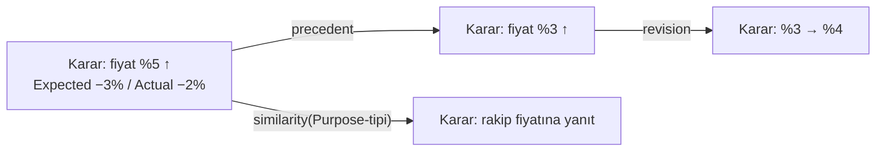

# ENS Company Memory

> P3'ün (Memory zekâ yaratır) teorisi ve ENS'in yapısal kilit taşı: Context Theory
> (ENS-2002) ilgililiği hesaplamak için buna bağımlı; Learning (P4) sonucu buraya yazar.
> `canon: false` — skeptic'ten sağ çıkınca Külliyat'a girer.
>
> **v0.2 notu:** [SKR-007](reviews/SKR-007-company-memory.md)'ye yanıt. (1) Purpose-tipi
> taksonomisi **Enterprise Ontology'ye** bağlanıp dairesellikten çıkarıldı, (2)
> survivorship bias'a **karşı-survivorship retention** mekanizması eklendi, (3) attribution
> borcu adlandırılmış bir kavrama — **ENS-2004 Learning Theory** — yükseltildi. §Yanıt tablosu
> sonda.

## Definition

**Company Memory, *neden*'in belleğidir — yalnızca *ne*'nin değil** (P3). Kalıcı, geri
getirilebilir bir kayıt: **commit-edilmiş kararların** (ENS-2001) Purpose'u, Context'i,
Alternatives'i, gerekçesi ve **ölçülmüş sonucu**, bir **Memory Graph** olarak. Veritabanı
*ne*'yi saklar (stok = 400); Company Memory *neden*'i ve *ne olduğunu* saklar.

## Motivation — neden *neden*?

P3: belleksiz organizasyon hatalarını tekrar eder. Bir kararın *neden*'i (Purpose, Context,
Alternatives, Assumptions) saklanmazsa, gelecekteki karar verici aynı akıl yürütmeyi — ve
aynı hatayı — sıfırdan üretir. *Neden*'in belleği, LAW-ORG-MEMORY'nin panzehridir.

## Historical context — ve konumlandırma

| Öncül | Ne verdi | ENS ile örtüşme | ENS'in (dar) delta'sı |
|-------|----------|-----------------|------------------------|
| **Walsh & Ungson (1991)** | Organizational memory; 5 retention bin | *Neden*'i saklama | Karar-merkezli (commit-edilmiş düğüm) + outcome/learning kapanışı |
| **CBR** (Aamodt & Plaza 1994; 4 RE) | retrieve-reuse-revise-retain; **case-base maintenance** (forgetting/silme dahil) | Benzer vaka getirme **ve forgetting** kısmen CBR'da | Dar delta: **salience sönümle, kaydı asla silme (audit)** + yapılı Decision Object + explainability invariant |
| **Nonaka & Takeuchi (1995)** | SECI, tacit/explicit | Bilgi dolaşımı | Bilgi yaratımı değil, **karar belleği** |
| **Argyris & Schön** | Single/double-loop öğrenme | Learning'in belleğe ihtiyacı | Double-loop'un *substratı* |
| **RAG / Vector DB** | Semantic retrieval mekaniği | Teknik erişim | Teori değil substrat |

**Dürüst delta:** "geçmiş kararı hatırla, benzerini getir, gerektiğinde unut" fikri özgün
değildir (CBR bunların hepsini içerir — case-base maintenance forgetting'i de). ENS'in dar,
gerçek katkısı: belleğin birimi **commit-edilmiş Decision Object**, geri getirme **outcome-
bağımsız Purpose-tipi** ile (§Model 2), unutma **kaydı silmeden salience sönümü** ile (§Model
3) ve retention **learning-önceliklidir** (§Model 3).

## Theoretical model

### 1. Memory Graph
- **Düğümler:** commit-edilmiş kararlar (ENS-2001 — sayılabilir, sınırlı).
- **Kenarlar (Memory Links):** precedent, revision, influence, similarity(Purpose-tipi),
  contradiction.
- Her düğüm: Decision Object'in tüm alanları + `Actual Outcome` + `Learning`.

### 2. Retrieval ve Purpose-tipi taksonomisi (SKR-007 Bulgu 1)
Retrieval, **benzer Purpose-tipli** geçmiş kararları getirir. Kritik: **Purpose-tipi,
Enterprise Ontology'de (ENS-4xxx, Canon) tanımlı, outcome'dan bağımsız bir sınıflandırmadır.**
Sınıflandırma yalnızca **beyan edilen niyetten** yapılır — Purpose, framing anında (ENS-2001
lifecycle), commitment'tan ve herhangi bir memory getiriminden **önce** bellidir. Niyet-ifadesi
(ör. fiil+nesne: "fiyat belirle", "tedarikçi seç", "bütçe tahsis et"), kararın context'ine ya
da sonucuna bakmadan bir ontoloji sınıfına eşlenir.

Bu dairesel değildir: sınıflandırmanın girdisi (beyan edilen niyet) memory getiriminden
bağımsızdır. Taksonomi Enterprise Ontology'de yaşar; zamanla zenginleşir ama hiçbir zaman
şimdiki kararın memory'sine bağlı değildir. (Cold-start: ontolojide olmayan yeni bir niyet
türü → yeni sınıf açılır, zayıf getirim → düşük Confidence — doğru davranış.)

### 3. Retention, Forgetting ve karşı-survivorship (SKR-007 Bulgu 2)
Veritabanı her şeyi saklar; **bellek unutmalıdır** (P5). Politika:
- **Retention önceliği ∝ |Learning|**, outcome'un pozitifliği değil. Yani **başarısız ama
  ölçülmüş kararlar en yüksek retention önceliğini alır** — çünkü priorları en çok günceller.
  Bu, survivorship bias'ın doğrudan panzehridir: ENS başarısızlığın *neden*'ini daha güçlü
  hatırlar.
- **Sönümle (decay), silme:** superseded/bayat kararların geri-getirme **salience**'ı düşer;
  kayıt **silinmez** (audit).
- **Sıkıştır:** tekrarlayan kararlar bir örüntüye (Decision DNA) özetlenir; ama en az bir
  başarısızlık örneği örüntü içinde korunur (ders kaybolmasın).

**LAW-ORG-MEMORY gerilimi çözümü:** ENS **salience'ı sönümler, kaydı asla silmez.** Unutulan,
*neden* değil, superseded ayrıntının *önceliğidir*. Böylece "neden'i unutma" (yasa) ile
"gürültüyü azalt" (P5) çelişmez.

### 4. Exploration (SKR-006 OC1)
Saf Purpose-benzerliği exploitation'dır; kör nokta üretir (March 1991). Company Memory bir
**exploration modu** taşır: ara sıra benzerlik-dışı ama potansiyel ilgili karar/context'i
yüzeye çıkarır (serendipity retrieval). Exploration/exploitation dengesi bir politika parametresi.

### 5. Attribution bağımlılığı — ENS-2004'e yükseltme (SKR-007 Bulgu 3)
Company Memory'nin retention'ı (§3, "ölçülmüş sonuç") ve Context relevance (ENS-2002) ve
Learning (P4), **hepsi outcome'un karara atfına** dayanır. Bu borç (R2 / ENS-1000 §VII) artık
üç kavramın taşıyıcı kolonudur ve süresiz ertelenemez.

**Taahhüt:** attribution, adlandırılmış bir Faz 2 kavramına — **ENS-2004 Learning Theory** —
yükseltilir. Company Memory, sonucun karara atfını *çözmez*; yalnızca `Expected`/`Actual`'ı ve
bir **attribution confidence**'ı saklar. Atfın *nasıl* yapılacağı (counterfactual, atfedilebilir
sınıf sınırı) ENS-2004'ün konusudur. Company Memory bu bağımlılığı açıkça kabul eder ve
`referenced_by: ENS-2004` ile işaretler.

## Implications
- **Context hesaplanabilirliği** buradan gelir (ENS-2002 yapısal bağımlılığı).
- **Decision Entropy** (gelecek) tutarlılığı memory'ye karşı ölçer.
- **Enterprise IQ** memory kalitesiyle büyür (P4 döngüsü).

## Relationships
- **→ Decision Theory (ENS-2001):** düğümler = commit-edilmiş kararlar.
- **→ Context Theory (ENS-2002):** relevance kaynağı (yapısal bağımlılık).
- **→ Learning Theory (ENS-2004, gelecek):** attribution ve outcome-ölçümü buraya yükseltildi.
- **→ Enterprise Ontology (ENS-4xxx):** Purpose-tipi taksonomisinin kaynağı.
- **→ LAW-ORG-MEMORY:** §3'te salience/record ayrımıyla keskinleştirildi.

## Examples
**Tekrar önleme:** yeni tedarikçi seçimi → memory, benzer Purpose-tipli eski kararı ve "bu
tedarikçi tipi geç teslim etti" başarısızlık öğrenimini getirir (karşı-survivorship: bu
başarısızlık *özellikle* saklanmıştı).

**Purpose-tipi:** "bütçe tahsis et" niyeti, context'e bakmadan Enterprise Ontology'deki
`capital-allocation` sınıfına eşlenir; getirim bu sınıf üzerinden yapılır.

## Laws
LAW-ORG-MEMORY'yi keskinleştirir (§3). Decision Capital ve Decision Entropy, Memory Graph
üzerinde tanımlanacak.

## Failure conditions (Anayasa Madde X)
- **Memory poisoning (yanlış ders).** Şansla iyi sonuç veren karar (confounding) yanlış ders
  kodlar. Attribution confidence (ENS-2004) sınırlar ama yok etmez — R2'ye zincirli.
- **Ontoloji eksikliği.** Purpose-tipi taksonomisi Enterprise Ontology'nin olgunluğuna bağlı;
  ontoloji zayıfsa getirim kabalaşır. (Dairesel değil, ama ontolojiye bağımlı.)
- **Ölçek maliyeti (P5).** Enterprise ölçeğinde Memory Graph pahalı; compression bilgi kaybı
  riski taşır.
- **Individuation kör noktası (zincirli).** Düğümler commit-edilmiş kararlar; emergent/
  uncommitted kararlar (Mintzberg-Waters 1985) memory'de düğüm bırakmaz.

## SKR-007'ye yanıt
| Talep | Karşılandığı yer |
|-------|------------------|
| 1. Purpose-tipi taksonomisine dairesel-olmayan kaynak | §Model 2 (Enterprise Ontology, beyan-edilen niyet) |
| 2. Survivorship bias'a retention mekanizması | §Model 3 (retention ∝ |Learning|, başarısızlık öncelikli) |
| 3. R2/attribution'ı adlandırılmış kavrama yükselt + CBR delta daralt | §Model 5 (ENS-2004), §Historical (dar CBR delta) |

---

*Company Memory, organizasyonun *neden*'ini saklar; başarısızlığı daha güçlü hatırlar; ve
unutmayı kaydı silmeden, yalnızca önceliği sönümleyerek yapar.*
