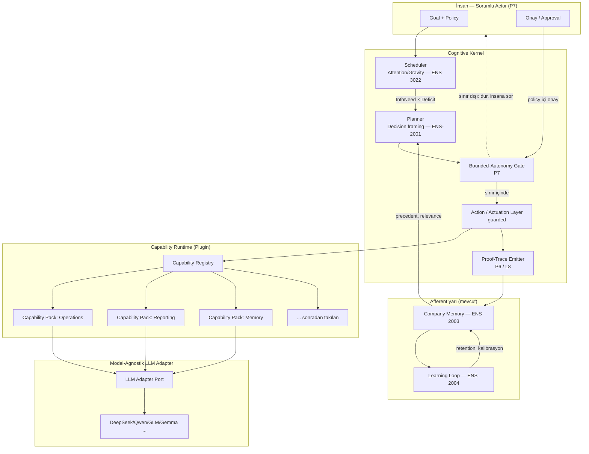
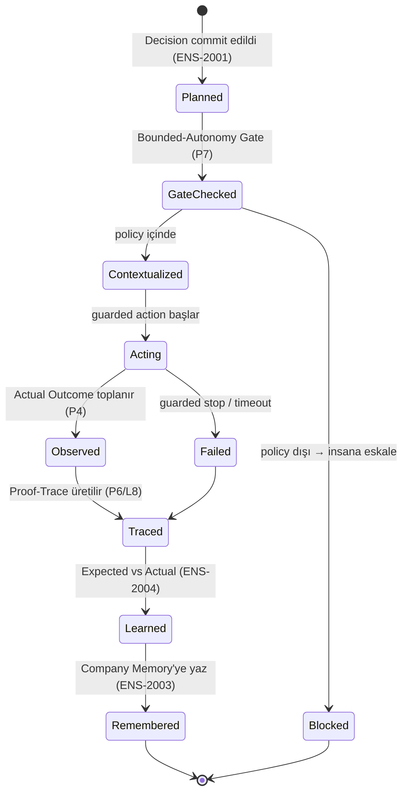
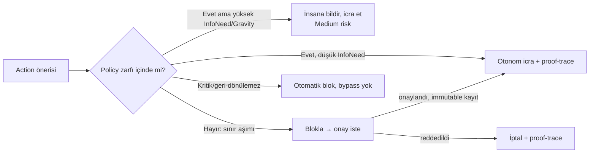
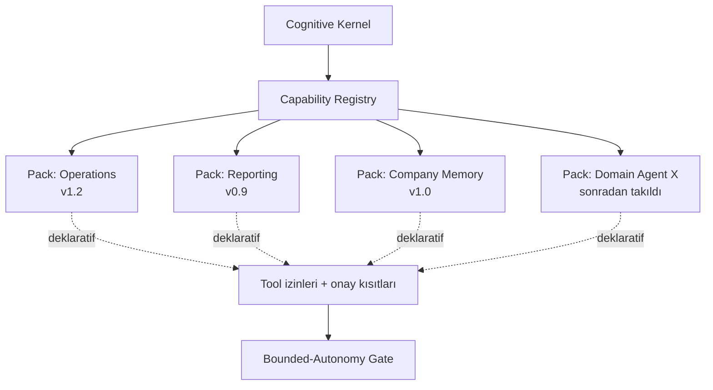

# ADR-0001 — ENS Agent Runtime & Bounded Autonomy

> **ADR yaşam döngüsü (Anayasa Madde XIV):** `Proposed → Accepted → Superseded`.
> Bu belge şu an **Proposed** (`status: draft`, `maturity: M0`). Skeptic saldırısı ve
> `ens-ceo` hiza incelemesi öncesi hiçbir alt-akış yapıtı (7000) buna dayanamaz.
>
> **Kapsam disiplini:** Bu ADR bir mimari *karardır*, kod değildir (Faz 3). Külliyat'ta var
> olmayan hiçbir kavram tanıtmaz (Madde IX); yalnızca mevcut teoriyi (ENS-2001/2003/2004,
> ENS-3022, ENS-4010, ENS-4025) bir çalışma-zamanı mimarisine *türetir*.
>
> **v0.2 — [SKR-024](../reviews/SKR-024-adr-0001.md)'e yanıt:** **D2** karşılandı — "action =
> Decision atomu" *commitment-sealed* action'lara daraltıldı, granülerlik ölçütü + F2 hafifletmesi
> eklendi (§5.4). **D3** karşılandı — `Policy` = `ens-core:Constraint` bundle olarak eşlendi,
> Madde IX uyumu sağlandı (§5.6, OQ2). **D1** (kernel-vs-pipeline karar ölçütü) kasıtlı açık —
> **ADR-0002 (operax) ampirik sınayacak.**
>
> **v0.3 — bağımsız [SKR-026](../reviews/SKR-026-adr-0001-independent.md)'ya yanıt** (D2/D3
> bağımsız teyit edildi): **Bulgu A** karşılandı — `Planner`/`Actuation Layer` artık §4 tablosunda
> ENS-2001 lifecycle aşamalarına (Framing-Reasoning / Enactment) açıkça `realizes` ediyor; orphan
> değiller, yeni teori gerekmedi. **Bulgu B** karşılandı — sınıflandırma edimi ayrı izsiz katman
> değil, Framing/Reasoning'in kendisi olarak yeniden çerçevelendi (§5.4); ikinci savunma hattı
> Bounded-Autonomy Gate. Sahip `ens-ai-architect` → `ens-architect`'e geçti (tasarım kararı,
> mimari tutarlılık gözetimi).

---

## 1. Bağlam (Context) — ENS'in eksik yarısı

ENS Külliyat'ı bugün organizasyonu bir **decision-producing cognitive system** olarak
modeller (Anayasa Madde I). Ama mevcut teori kütlesi ağırlıklı olarak sistemin **afferent**
(duyusal → bilişsel) yarısını tanımlar:

```
sense (Context, ENS-2002) → think (Decision, ENS-2001) → remember (Memory, ENS-2003) → learn (Learning, ENS-2004)
```

Bu yarı, bir kararın nasıl *çerçevelendiğini*, *gerekçelendiğini*, *hatırlandığını* ve
*öğrenildiğini* söyler. Söylemediği şey: **karar commit edildikten sonra ne olur?** ENS-2001
lifecycle'ında `Commitment → Enactment` geçişi vardır (kararın "dünyaya çıkması"), ama
*enactment'ın kendisi* — planlama, eyleme dökme (actuation), operasyon — teoride bir sınır
nesnesi olarak durur, çalışma-zamanı karşılığı yoktur. Yani ENS'in **efferent (motor)** yarısı
ve onu koşturacak **kernel** eksiktir:

```
plan → act → actuate → operate → observe(Actual Outcome, P4)   ← BU YARI YOK
```

Architecture-principles.md'nin katmanlı referans modeli bunu zaten öngörür: Layer 3 (Reasoning),
Layer 5 (Decision Engine — "öneri, emir değil"), Layer 6 (Learning Engine). Ama bu katmanları
*koşturan* çalışma-zamanı — kararı eyleme çeviren, dikkati tahsis eden, ajanları çağıran, her
adımın izini tutan **çekirdek (kernel)** — henüz bir mimari kararla bağlanmamıştır.

**Bu ADR o eksiği kapatır:** efferent yarıyı ve onu koşturan Cognitive Kernel'i, P7'nin çözümü
olan **bounded autonomy** ilkesiyle birlikte tanımlar.

### 1.1 Neden şimdi, neden bir kernel

North Star: **AI-native Enterprise OS, Reasoning = kernel.** Bir işletim sisteminde kernel,
kıt kaynağı (CPU) süreçlere tahsis eder, system call'ları aracılık eder, izolasyon ve erişim
denetimi uygular. ENS'te kıt kaynak **attention**'dır (P5); atom **Decision**'dır (P1); system
call **bir Decision'ın enactment'ı**dır. Dolayısıyla mimari soru şudur: kararı eyleme çeviren
katman bir **pipeline** mı (sabit, doğrusal bir akış), yoksa bir **kernel** mi (kaynak tahsis
eden, çağrı aracılığı yapan, denetleyen, izole eden bir çekirdek) olmalıdır?

Bu ADR **kernel** lehine karar verir. Gerekçe: pipeline sabit bir işi (ör. yazılım teslimatı)
otomatikleştirir; kernel *herhangi bir* capability'yi (operasyon, raporlama, bellek sorgusu)
attention-önceliğine göre koşturabilen genel bir çalışma-zamanıdır. ENS "herşeyi kazan" gereği
(her enterprise capability'nin sonradan takılabilmesi) yalnızca kernel + plugin mimarisiyle
karşılanır (§6).

---

## 2. Karar (Decision) — özet

ENS, efferent yarısını **ENS Agent Runtime** olarak inşa eder. Bu çalışma-zamanı beş birincil
bileşenden oluşur ve her biri bir Külliyat kavramını gerçekleştirir:

1. **Cognitive Kernel (Scheduler)** — kıt attention'ı (P5) Decision Gravity'ye (ENS-3022) göre
   capability-çağrılarına tahsis eden çekirdek. system call ≙ Decision enactment (P1).
2. **Capability Runtime (Plugin)** — her enterprise yetisi (operations, reporting, memory,
   domain agent) sonradan takılabilen, versiyonlu, sandbox'lı bir **Capability Pack** olarak.
3. **Action / Actuation Layer** — bir kararın planını dünyaya döken, ama her eylemi bir
   **guarded action** olarak yürüten (otomatik yıkıcı edim yok) katman.
4. **Action Proof-Trace** — her action, onu üreten kuralı/öncülleri/confidence'ını taşıyan
   izlenebilir bir kayıt üretir (P6, ENS-4025 L8). İzsiz action = black-box = **yasak**.
5. **Bounded-Autonomy Gate** — P7'nin çalışma-zamanı karşılığı: goal + policy + onay insanda,
   icra ajanda. Onaylanmamış bir sınır aşılamaz.

Ve bir **model-agnostik LLM Adapter**: hiçbir bileşen tek bir modele/sağlayıcıya bağlı değildir
(Anayasa: "mimariyi tek bir AI modeline kilitleme").

**Bir cümlede:** *ENS Agent Runtime, kararı (P1) bounded autonomy (P7) içinde, attention
tahsisiyle (P5) planlayıp eyleme döken ve her adımı proof-trace (P6) olarak kaydeden, model-
agnostik, plugin-tabanlı bir Cognitive Kernel'dir.*

---

## 3. Prior art (5-başlık — dürüst konumlandırma)

Anayasa Madde VI ve Külliyat disiplini gereği: kernel/agent-runtime fikri ENS'in icadı
değildir. Dürüst konumlanma:

| Öncül | Ne verdi | ENS ile örtüşme | ENS'in delta'sı |
|-------|----------|-----------------|------------------|
| **AIOS** (Mei vd., Rutgers, COLM 2025; arXiv:2403.16971) | LLM = kernel, agent = app; scheduler + context manager + memory manager + access control; "LLM syscall" | **Referans kernel deseni** — scheduler, context, memory, erişim denetimi katmanları | ENS kernel'i *bilişsel disiplinle* kuşatır: syscall ≙ Decision atomu (P1); scheduling ≙ Decision Gravity/VOI (ENS-3022, keyfi öncelik değil); her syscall proof-trace (L8) ve bounded-autonomy gate'ten geçer |
| **CrewOps** (dahili ampirik prototip) | PM-first akış, approval-gate governance, agent-takım orkestrasyonu, event-sourced state machine, model-agnostik `IExecutionWorker` | **Bounded autonomy'nin çalışan prototipi**: insan (PM) goal+onay verir, agent takımı icra eder | CrewOps bir *yazılım-teslimat pipeline'ı*dır (sabit state machine, CI/CD gate'leri). ENS bunu *genel bir bilişsel kernel'e* soyutlar: her action = Decision atomu; gate'ler CI/CD aşamaları değil, **VOI-tetiklemeli bounded-autonomy sınırları** |
| **LangGraph** (LangChain) | Stateful graph orchestration, checkpoint/durable state, insan-döngüde kesme | Event-sourced Decision + checkpoint ≙ ENS-2001 event history; traceability'e uygun graf | ENS grafın düğümlerini *Decision commitment'ları* (ENS-2001 individuation) olarak tipler; kenarları ENS-4010 Relation Registry'den alır; her adım confidence-propagating proof-trace taşır |
| **MemGPT / Letta** (Packer vd., 2023; "LLM as OS") | Üç-katman bellek (Core / Recall / Archival), self-editing memory, sleep-time consolidation | **Company Memory (ENS-2003) çalışma-zamanı deseni**; retention/decay | ENS belleğin birimini *commit-edilmiş Decision Object* yapar; retention ∝ |Learning| (ENS-2003 §3, karşı-survivorship); "unut ama kaydı silme" audit invariant'ı |
| **AutoGen / CrewAI** | Çok-ajanlı konuşma/rol orkestrasyonu, araç çağırma | Capability agent'ları + tool-calling | ENS ajanı bir *sohbet rolü* değil, ENS-4010 `Capability` node'unun çağrılabilir örneğidir; her tool-call guarded action + proof-trace |

**ENS delta özeti:** ENS "LLM-as-OS"u icat etmez — AIOS, MemGPT, CrewOps hepsi bu deseni
taşır. ENS'in dar, gerçek katkısı çekirdeğin *üstüne konan bilişsel disiplindir*: (a)
**decision-atom teorisi** (her action bir commitment, ENS-2001), (b) **explainability invariant**
(her adım proof-trace, ENS-4025 L8), (c) **bounded-autonomy governance** birinci-sınıf primitif
(P7), (d) **Company Memory teorisi** (ENS-2003), (e) **attention-as-VOI scheduling** (ENS-3022).
Yani: *disiplinli, yönetilen, açıklanabilir* bir AI-native enterprise OS.

---

## 4. Külliyat türetmesi (Traceability)

architecture-principles.md §Türetme kuralı gereği her bileşen için yanıtlanır:

| Bileşen | `realizes` (kavram) | `principles` | Teori ne öngörüyor |
|---------|---------------------|--------------|--------------------|
| Cognitive Kernel Scheduler | ENS-3022 (Decision Gravity) | P5 | `AttentionPriority(d) ∝ InfoNeed × ConformanceDeficit` — attention buraya gitmeli |
| Action = Decision atomu | ENS-2001 (Decision Theory) | P1 | Atom = commitment ile mühürlü karar; her enactment bir commitment |
| Action Proof-Trace | ENS-4025 (Semantic Logic L8) | P6 | Her türetilmiş olgu kuralı+öncülleri+confidence taşır; izsiz = yasak |
| Memory Runtime | ENS-2003 (Company Memory) | P3 | 3-katman, retention ∝ |Learning|, salience sönümü |
| Learning Loop | ENS-2004 (Learning Theory) | P4 | Actual vs Expected, attribution merdiveni, donmuş snapshot |
| Bounded-Autonomy Gate | ENS-2001 §Individuation (tek Owner, P7) | P7 | Sorumluluk insanda; ENS önerir, emretmez |
| Capability node | ENS-4010 (Foundational Ontology) | P1 | `Capability` (Resource profili) = amaca hizmet eden çağrılabilir yeti |
| **Planner** (SKR-026 Bulgu A) | ENS-2001 lifecycle — **Framing → Contextualization → Reasoning** (commitment-öncesi) | P1, P2 | Planner yeni bir kavram değil; Decision'ın commitment-öncesi üç aşamasının çalışma-zamanı yürütücüsüdür. §5.2 diyagramı bunu zaten "Decision framing" etiketiyle işaretliyordu — burada resmîleşiyor. |
| **Actuation Layer** (SKR-026 Bulgu A) | ENS-2001 lifecycle — **Enactment** (commitment-sonrası) | P1, P7 | Actuation, Enactment aşamasının guarded yürütücüsüdür. "operate" (sürekli yürütme) ayrı bir primitif değildir: §5.4 granülerlik ölçütüne göre mekanik alt-adımlar tek bir Enactment'ın *içinde* kalır, ayrı atom doğurmaz — bu yüzden "sürekli operasyon" için yeni teoriye gerek yoktur. |

Header `realizes: [ENS-2001, ENS-2004]` çekirdek iki gerçekleştirmedir (decision-atom + learning
kapanışı); `depends_on` ve `requires` yukarı-akış türetme zincirinin tamamını taşır. Bu ADR
**hiçbir yeni kavram tanıtmaz**; "Cognitive Kernel", "Capability Runtime" vb. Külliyat
kavramlarının (Attention/Decision/Capability/Memory) çalışma-zamanı *bileşimleridir*, yeni
teori değildir (Madde IX uyumu).

---

## 5. Mimari — Cognitive Kernel

### 5.1 OS-primitifi ↔ ENS-teorisi ↔ substrat eşlemesi

| OS primitifi | ENS teorisi | Açık kaynak substrat (referans) |
|--------------|-------------|----------------------------------|
| Kernel system call | Decision enactment (P1, ENS-2001) | AIOS LLM-syscall |
| Scheduler | Attention tahsisi (P5, ENS-3022) | AIOS scheduler |
| Memory manager (3-tier) | Company Memory (ENS-2003) | Letta Core/Recall/Archival |
| Context manager (snapshot/restore) | Context Theory (ENS-2002) | AIOS context snapshot |
| Process / agent | Capability invocation (ENS-4010) | LangGraph node / AutoGen agent |
| Access control | Bounded-Autonomy Gate (P7) | CrewOps ApprovalGate |
| Audit / trace | Proof-trace (P6, ENS-4025 L8) | event-sourcing / TMS justification |
| Learning daemon | Learning loop (P4, ENS-2004) | Letta sleep-time consolidation |
| Device driver | model-agnostik LLM Adapter | CrewOps `IExecutionWorker` |

Kernel ≠ deployment topolojisi; architecture-principles §Layer notundaki gibi bir *akıl yürütme
aracı*dır. Servis sınırlarını bounded context'ler tanımlar.

### 5.2 Kernel bileşen diyagramı



### 5.3 Scheduler — attention tahsisi (P5, ENS-3022)

Kernel scheduler'ı keyfi bir kuyruk değildir; **Decision Gravity'nin operasyonel biçimidir.**
ENS-3022 §Model 3:

```
AttentionPriority(d) ∝ InfoNeed(d) × max(ConformanceDeficit(d), 0)
                     = Stake × (1 − Confidence) × (peer-context açığı)
```

Kernel, bekleyen capability-çağrılarını (pending Decision'lar) bu önceliğe göre sıralar. Yüksek
stake + yüksek belirsizlik + az-context'li kararlar hem insan dikkatinin (bounded-autonomy
gate) hem hesaplama kaynağının (model tier seçimi) önüne çıkar. Bu, "scheduler neye göre
öncelik verir?" sorusuna teori-temelli bir yanıttır (AIOS'ta bu boş bırakılır; ENS onu VOI'ye
bağlar). **Model tier seçimi** de buradan türer: yüksek InfoNeed → daha güçlü reasoning modeli
(Critical tier); rutin, düşük-stake action → hafif model (Operational tier) — token maliyeti
attention-önceliğiyle hizalanır.

### 5.4 Action ve Decision atomu (P1) — granülerlik (SKR-024 D2)

**Her action bir Decision atomu DEĞİLDİR.** Yalnızca **commitment-sealed action'lar** Decision
atomudur (ENS-2001 §Individuation): tek Owner (sorumlu insan gate'te), tek Purpose, açık
Alternatives, tek Commitment olayı. Yüksek-frekanslı, düşük-stake **mekanik alt-adımlar** (rutin
veri çekme, bir API çağrısı, bir dosya okuma) ENS-2001 özyineleme'sine göre atomun *içindeki
yürütmedir* — ayrı atom değil.

**Granülerlik ölçütü:** bir action yeni bir Decision atomu (commitment) doğurur ⇔ (a) geri-
dönülemez ya da stake'i eşiği aşan bir taahhüt içerir, **veya** (b) Alternatives arasından
bir *seçim* gerektirir (birden çok makul yürütme yolu). Aksi hâlde deterministik/mekanik
adımdır ve içinde bulunduğu atomun sub-step'idir. Böylece yalnızca commitment-sealed action'lar
*sayılabilir/izlenebilir/öğrenilebilir* Decision Graph düğümü olur.

**Sonuç (F2 hafifletmesi):** proof-trace (P6/L8) **atom düzeyinde** zorunludur, her mekanik
sub-step'te değil. Sub-step'ler atomun proof-trace'i içinde toplu izlenir. Bu, §11 F2 (proof-
trace ölçek maliyeti) baskısını azaltır: milyonlarca mekanik adım değil, commitment'lar izlenir.

**Sınıflandırma ediminin izlenebilirliği (SKR-026 Bulgu B):** "atom mu, sub-step mi?" kararı
ayrı, izsiz bir meta-karar *değildir* — ENS-2001 lifecycle'ının **Framing/Reasoning**
aşamasının kendisidir. Alternatives kümesi framing sırasında zaten belirlenir (ENS-2001 §1);
Alternatives tekil ve deterministikse (a) ve (b) baştan sağlanmaz → sub-step. Bu değerlendirme,
Decision Object'in kendi `Alternatives` alanına yazılır ve dolayısıyla **atomun proof-trace'i
tarafından zaten kapsanır** — ayrı bir izlenmeyen katman eklenmez. Yanlış sınıflandırma riski
(gerçek bir commitment'ı sub-step sayma) §5.6 Bounded-Autonomy Gate'in stake-eşiği kontrolüyle
ikinci bir savunma hattı bulur: eşik-aşan bir action, alt-sınıflandırılsa bile gate'te yakalanır.

Action yaşam döngüsü, ENS-2001 lifecycle'ının Enactment sonrası kısmının
çalışma-zamanı karşılığıdır (CrewOps `ExecutionRun` deseninin ENS'e soyutlanması):



Her geçiş bir **AuditEvent** (event-sourced) üretir; hiçbir katman bu lifecycle'ı atlayamaz —
CrewOps `ProjectStateMachine`'in `InvalidTransitionException` invariant'ının ENS karşılığı. Bu,
ENS-2001'in "karar bir satır değil, olay geçmişidir" iddiasının çalışma-zamanına inişidir.

### 5.5 Action Proof-Trace (P6, ENS-4025 L8) — invariant

**İzsiz action yoktur.** Her action, ENS-4025 L8 sözleşmesine uyan bir proof-trace zarfı
üretir: hangi kural/plan onu doğurdu, hangi öncüller (Context, Evidence, Memory precedent),
hangi confidence, hangi alternatifler elendi. Biçim, ENS-4025 §Proof-trace biçimini action'a
uyarlar:

```
Goal-7 --requires--> Capability-Deploy --selected_plan--> Action-42
   ⇒ [BAG-OK policy P-3 içinde; onay: human-fikri @ t]
   ⊢ Action-42 enacted (conf = min(plan=0.8, context=0.7) = 0.7)
   ⊢ Actual Outcome measured → Learning-42 (Δ = Actual − Expected)
```

Confidence propagation varsayılan `min` (ENS-4025 L7). Bir action'ın confidence'ı, onu üreten
planın ve context'in confidence'ının t-norm'udur. **Proof-trace opsiyon değil, aksiyomdur**
(Anayasa Madde VI: açıklama nesnesi olmayan çıktı = anti-pattern). Bu, ENS Agent Runtime'ı
AIOS/CrewOps'tan ayıran çekirdek invariant'tır: onlarda audit-log *sonradan eklenen* bir
gözlemdir; ENS'te proof-trace *action'ın var-olma koşuludur*.

### 5.6 Bounded Autonomy (P7) — kernel'in erişim denetimi

P7 ("sorumluluk insandadır; ENS önerir, emretmez") *tam otonomiyi* de *sıfır otonomiyi* de
reddeder. Çözüm **bounded autonomy**:

> **Policy tanımı (SKR-024 D3, Madde IX):** `Policy` yeni bir kavram *değildir* — ENS-4010
> `ens-core:Constraint` node'larının adlandırılmış bir **bundle**'ıdır (birleşimidir). Bir Policy
> = {bütçe Constraint'i, geri-dönülemezlik-eşiği Constraint'i, izinli/yasak-capability
> Constraint'leri, risk-toleransı Constraint'i}. Böylece ADR Külliyat'ta olmayan bir kavram
> tanıtmaz; mevcut `Constraint`'i (ENS-4010) bir demet olarak kullanır. `constrains` ilişkisi
> (Constraint → Decision/Capability) gate'in uyguladığı kuraldır.

- **İnsan koyar:** Goal (ne başarılacak) + Policy (= Constraint bundle: bütçe, geri-dönülemezlik
  eşiği, izinli/yasak capability'ler, risk toleransı) + kritik noktalarda **onay**.
- **Kernel/ajan icra eder:** policy zarfının *içinde* plan yapar, action alır, gözlemler,
  öğrenir — insana her adımı sormadan.
- **Gate durur:** bir action policy zarfını aşacaksa (ör. geri-dönülemez, yüksek-stake, yasak
  capability) Bounded-Autonomy Gate onu **bloklar** ve insana eskale eder — CrewOps
  `ApprovalGate` + `RiskGateEngine` desenlerinin ENS soyutlaması.



Risk seviyeleri Decision Gravity'ye bağlanır: yüksek `AttentionPriority(d)` → daha sıkı gate.
Böylece bounded autonomy *statik bir izin listesi* değil, **VOI-duyarlı, dinamik bir sınırdır**.
Kritik/geri-dönülemez action'larda bypass yasaktır; istisna yalnızca immutable audit kaydı
üreten kontrollü bir Exception-Policy ile mümkündür (CrewOps `ExceptionPolicyEngine` deseni) —
ama her istisna sonsuza dek izde kalır.

---

## 6. Plugin mimarisi — Capability Runtime ("herşeyi kazan")

Enterprise "herşeyi kazan" gereği: operasyonlar, raporlama, bellek sorguları, domain-özel
ajanlar — hepsi *sonradan takılabilmeli.* Bu yalnızca **kernel + plugin** ile mümkündür (sabit
pipeline ile değil). CrewOps'un `CapabilityPack` / `RoleProfile` / `CapabilityRegistry`
modelinin ENS'e soyutlaması:

- **Capability Pack** — versiyonlu, domain-scoped, kendine yeten bir yeti paketi. Bir Pack'in
  kurulması diğerini etkilemez. Her Pack ENS-4010 `Capability` node'unun bir örnek-kümesini
  kernel'e kaydeder.
- **Capability Registry** — tüm pack'lerin merkezi otoritesi; başlangıçta yüklenir, proje/tenant
  bazında etkinleştirilebilir/devre-dışı bırakılabilir, versiyon çakışmalarını *sessizce çözmez*,
  uyarır. Local-first; internet-marketplace değil (V1 sınırı).
- **Tool-calling & izinler** — her Pack, izinli/yasak araçlarını (`allowedTools` / `deniedTools`)
  ve onay-kısıtlarını (`requiresHumanApprovalFor`) deklaratif taşır. Bu, Bounded-Autonomy
  Gate'in policy zarfını besler.
- **Progressive context (3-tier skill)** — Pack bilgisi Letta/CrewOps deseniyle üç katmanda
  yüklenir (metadata her zaman, talimat aktivasyonda, kaynak talep üstüne) — attention/token
  bütçesi (P5) korunur.
- **Sandbox** — her Capability action'ı izole bir workspace'te koşar; guarded (otomatik yıkıcı
  edim yok, patch yalnızca onayla uygulanır — CrewOps Guarded Mode). Prompt-injection'a karşı
  skill-içeriği sanitizasyonu birinci savunma hattıdır (Anayasa Madde V "güvenli" + failure
  condition §8).



Böylece ENS *çekirdeğini değiştirmeden* yeni yetenek kazanır: kernel değişmez, Pack takılır. Bu,
Anayasa Madde V "Replaceable / Modular" niteliğinin doğrudan uygulanışıdır.

---

## 7. Model-agnostik LLM Adapter

Anayasa ("mimariyi tek bir AI modeline kilitleme") ve architecture-principles §Sınırlar gereği:
kernel hiçbir modele bağlı değildir. CrewOps `IExecutionWorker` / `CanHandle(RoleProfile)`
deseninin ENS soyutlaması — bir **LLM Adapter Port**:

- Adapter, "bu planı/prompt'u çalıştır, sonucu (TaskObservation benzeri normalize zarf) getir"
  der; *nerede/nasıl* koştuğu implementasyona bırakılır (yerel CLI, API, açık-kaynak MoE).
- Yeni bir model eklemek = yeni bir Adapter implementasyonu; mevcut kernel/capability koduna
  dokunulmaz.
- 2026 açık-kaynak substratı adapter arkasında değiştirilebilir: **DeepSeek-R1/V4** (MoE,
  reasoning-yoğun → Critical tier), **Qwen** (verimli → Complex), **GLM-5.2**, **Gemma** (edge →
  Operational). Model tier ↔ InfoNeed eşlemesi (§5.3) adapter seçimini yönlendirir.

Bu, "device driver" primitifidir: kernel kararı verir, adapter donanımı (modeli) sürer.

---

## 8. Alternatifler (değerlendirilen ve reddedilen)

| Alternatif | Neden reddedildi |
|-----------|-------------------|
| **A1 — Sabit pipeline (CrewOps'u olduğu gibi benimse)** | CrewOps yazılım-teslimatına özel state machine'dir; "herşeyi kazan" (genel capability) gereğini karşılamaz. Deseni alınır, mimarisi genelleştirilir. Pipeline ≠ kernel. |
| **A2 — Tam otonom agent (insan-döngü-dışı)** | P7 ihlali. Sorumluluk insanda kalmalı; ENS emretmez, önerir. |
| **A3 — Her adımda insan onayı (sıfır otonomi)** | P5 ihlali (insan attention'ı kıt; her adım onay onu tüketir). Bounded autonomy tam da bu iki uç arasındaki çözümdür. |
| **A4 — Tek modele optimize monolitik runtime** | Anayasa "mimariyi kilitleme" ihlali; model-agnostik adapter zorunlu. |
| **A5 — AIOS'u doğrudan benimse** | AIOS scheduler'ı keyfi; ENS'in decision-atom + proof-trace + VOI-scheduling + bounded-autonomy disiplinini taşımaz. AIOS *substrat* olarak alınır, ENS *disiplin* olarak eklenir. |
| **A6 — Proof-trace'i opsiyonel/sonradan-log yap** | Anayasa Madde VI + ENS-4025 L8 ihlali. Proof-trace action'ın var-olma koşuludur, gözlem değil. |

---

## 9. Sonuçlar (Consequences)

**Olumlu:**
- ENS'in efferent yarısı ve kernel'i mimari olarak bağlanır; Layer 3-6 çalışma-zamanı kazanır.
- Her action bir Decision atomu → tam izlenebilirlik, öğrenilebilirlik, audit (P1/P4/P6).
- Bounded autonomy P7'yi *pratikte* çözer: ölçeklenir (P5) ama sorumluluğu insanda tutar.
- Plugin mimarisi "herşeyi kazan"ı karşılar; kernel değişmez, capability takılır.
- Model-agnostik adapter geleceğe-dayanıklıdır (2026 açık-kaynak modelleri takılıp çıkarılır).

**Olumsuz / maliyet:**
- Her action'ın proof-trace + event-sourcing üretmesi depolama/işlem maliyeti getirir (ENS-2003
  §Failure "ölçek maliyeti" ile zincirli).
- Bounded-Autonomy Gate yanlış kalibre edilirse ya çok bloklar (P5 israfı) ya çok geçirir (P7
  riski). Gate eşiği Decision Gravity kalibrasyonuna (ENS-3022, ENS-2004) bağımlıdır.
- Kernel + plugin + adapter üç ayrı değiştirilebilirlik ekseni → mimari karmaşıklık; sıkı
  kontrat disiplini gerektirir.

---

## 10. ENS delta (bir kez daha, net)

ENS Agent Runtime, LLM-as-OS / agent-runtime desenini **icat etmez** (AIOS, CrewOps, LangGraph,
MemGPT, AutoGen hepsi taşır). ENS'in kattığı, çekirdeğin üstündeki **bilişsel disiplindir**:

1. **Action = Decision atomu** (ENS-2001) — her eylem commitment, sayılabilir/öğrenilebilir.
2. **Explainability invariant** (ENS-4025 L8) — izsiz action yasak.
3. **Bounded-autonomy** birinci-sınıf governance primitifi (P7) — statik izin değil, VOI-duyarlı sınır.
4. **Company Memory teorisi** (ENS-2003) — bellek birimi commit-edilmiş karar, retention ∝ |Learning|.
5. **Attention-as-VOI scheduling** (ENS-3022) — scheduler keyfi değil, Decision Gravity.

Yani: *disiplinli, yönetilen, açıklanabilir* bir AI-native enterprise OS çekirdeği.

---

## 11. Failure conditions (Anayasa Madde X)

Bu ADR bir mimari karardır; yine de yanlışlanabilirlik ödevini taşır. Bu karar **yanlış olur** eğer:

- **F1 — Action ≠ commitment.** Eğer değerli enterprise action'larının çoğu ENS-2001
  individuation ölçütünü (tek Owner/Purpose/Commitment) sağlamıyorsa (ör. sürekli, kesintisiz,
  commit-edilmemiş operasyonel akışlar), "her action bir Decision atomu" soyutlaması değerin
  azınlığını yakalar — ENS-2001 §Failure "örtük karar kapsamı" ile zincirli.
- **F2 — Proof-trace maliyeti prohibitif.** Enterprise ölçeğinde her action için L8 proof-trace +
  event-sourcing üretmek, faydasını aşan bir depolama/gecikme maliyeti getirirse, invariant
  pratikte gevşetilir (ve gevşetilirse Anayasa Madde VI ihlaline döner) — bu bir ikilemdir, Faz 4
  ölçüm gerektirir.
- **F3 — Gate kalibrasyonu çözülemez.** Bounded-Autonomy Gate eşiği Decision Gravity'ye bağlıdır;
  Confidence kötü kalibreyse (ENS-2004 borçları) InfoNeed bozulur → gate ya çok bloklar ya çok
  geçirir. Kalibrasyon olgunlaşmadan bounded autonomy güvenilir çalışmaz.
- **F4 — Kernel gereksiz (pipeline yeterli).** Eğer pratikte tüm enterprise capability'ler tek bir
  sabit iş-akışına indirgenebiliyorsa, kernel'in genelliği gereksiz karmaşıklıktır ve daha basit
  bir pipeline (A1) yeterli olurdu. Kernel'in değerini, *heterojen, sonradan-takılan* capability
  çeşitliliğinin varlığı kanıtlamalıdır.
- **F5 — Model-agnostisizm sızıntısı.** Eğer reasoning kalitesi tek bir modele öyle bağımlıysa ki
  adapter değişince kernel davranışı bozuluyorsa, "model-agnostik" iddiası yanlıştır; adapter
  soyutlaması sızdırıyordur.

---

## 12. Açık sorular (skeptic'e ve sonraki fazlara)

- **OQ1 (RFC adayı):** Proof-trace şeması, ENS-4025 L8 ve L7 (confidence t-norm) için makine-
  çalıştırılabilir biçim — bir RFC-6xxx gerektirir mi? (ENS-4025 §Failure "formal dil Faz 4".)
- **OQ2 — ÇÖZÜLDÜ (v0.2, D3):** Policy = `ens-core:Constraint` bundle (ENS-4010). Yeni kavram
  yok; mevcut `Constraint` node'unun demeti. Bkz §5.6.
- **OQ3:** Kernel scheduler'ın Decision Gravity hesabı gerçek-zamanlı mı, yoksa periyodik triage
  mı? (ENS-3022 "sürekli örgütsel" vs per-decision maliyet gerilimi.)
- **OQ4:** Capability Pack versiyon çakışması ve tenant izolasyonu — bir Faz 4 (7000) spesi mi?

---

## 13. İzlenebilirlik özeti

```
ADR-0001 (bu belge)
  ├─ realizes → ENS-2001 (Decision), ENS-2004 (Learning)
  ├─ depends_on → ENS-0000, ENS-2002, ENS-2003, ENS-3022, ENS-4010, ENS-4025
  ├─ principles → P1 (atom), P5 (attention), P6 (explainability), P7 (bounded autonomy)
  └─ origin → Anayasa Madde III, V, IX + architecture-principles §Layer 3-6
```

Bu ADR kabul edilmeden (Proposed → Accepted, Madde XIV) hiçbir 7000-reference-implementation
yapıtı ona dayanamaz. Sonraki adım: `ens-skeptic` saldırısı (F1-F5 ve OQ1-4 üzerinden),
`ens-ceo` uzun-vade hiza incelemesi, `ens-style-guardian` tutarlılık denetimi.

---

*ENS Agent Runtime, kararı eyleme döken çekirdektir — ama her eylemi bir taahhüt olarak sayar,
her adımı izlenebilir kılar, otonomiyi insanın koyduğu sınırda tutar. Kernel'i icat etmez;
üstüne disiplini koyar.*
