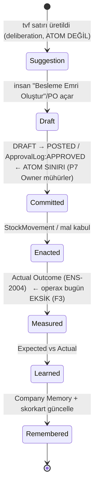

# ADR-0002 — Operations Capability Pack

> **ADR yaşam döngüsü (Anayasa Madde XIV):** `Proposed → Accepted → Superseded`.
> Bu belge şu an **Proposed** (`status: draft`, `maturity: M0`). ADR-0001'e (Cognitive Kernel)
> dayanır; ADR-0001 henüz `Proposed` (SKR-024 *wounded*) olduğundan bu belge de onunla birlikte
> olgunlaşır. Skeptic saldırısı öncesi hiçbir 7000 yapıtı buna dayanamaz.
>
> **v0.3 (2026-07-24):** SKR-025/027'nin kalan üç talebi (Bulgu 1: operax kod-doğrulaması + "≥4→3"
> tutarlılığı; Bulgu 2: delta ↔ F yumuşatması; Bulgu 3: Confidence-elicitasyon boşluğu) sahibi
> (ens-architect) tarafından kapatıldı. **Bu bir öz-düzeltmedir → G2/G3 gereği yazar kendi
> düzeltmesini onaylayamaz; ADR-0002 Accepted'a ilerlemeden önce v0.3 için bağımsız YENİ bir
> ens-skeptic turu gerekir.** Bulgu C/D (ENS-4020 validation + döngü) zaten kapalı (SKR-028/030,
> ENS-4020 M2).
>
> **CEO-0003 notu (2026-07-24, `ens-ceo` hiza incelemesi, Madde XIV):** Kullanıcı bu oturumda
> operax'ın **aktif geliştirmesini durdurma** kararı aldı — öncelik ENS'te; operax'ı ENS ile
> entegre çalışır hale getirme işi tarihi belirsiz, **ilerleyen bir faza ertelendi** (iptal değil,
> erteleme). Bu, D1'in mevcut kernel sonucunu **etkilemez**: §7.2 Katman B'nin K1 zemini operax'ta
> *zaten var olan* 3 kod-doğrulanmış lifecycle'a dayanıyor, gelecekte inşa edilecek M04/RFQ'ya
> değil (§11 OQ7 bu materyalleşmeyi zaten koşullu/spekülatif işaretlemişti). Dahası, operax'ın
> dondurulması F2'nin asıl uyardığı risk yönünü (3 lifecycle'ın birleşip K1 eşiğinin altına
> düşmesi) de büyütmüyor — aksine mevcut modüller refactor edilmeyeceği için hafifçe istikrar
> kazandırıyor. Ama **F3/F4/OQ1/OQ2/OQ6'nın kapanışı** (learning-kapanışı, Confidence-elicitasyonu,
> §7.3 VOI-önceliklendirmesi) — bunlar zaten "vaat düzeyinde, Faz-4 borcu" diye işaretliydi (§3,
> §5.3, §13) — artık *belirsiz bir tarihe* bağlı: kapanış ya operax'ın kendi kod tabanında ya da
> gelecekteki ENS↔operax entegrasyon köprüsünde gerçekleşecek, ve o iş kullanıcı kararıyla
> öncelik sırasında geriye alındı. Bu yeni bir açık değil, zaten dürüstçe işaretli bir borcun
> zamanlamasını netleştiriyor. Ayrıntı: `5000-architecture/reviews/CEO-0003-adr-0002-alignment.md`.
>
> **Kapsam disiplini:** Bu bir mimari *karardır*, kod değildir (Faz 3). operax kodunu kopyalamaz;
> operax'ın *çalışan karar-önerisini* ENS capability mimarisine ve Decision teorisine (ENS-2001)
> çevirir. Yeni Külliyat kavramı tanıtmaz (Madde IX) — mevcut `Capability`/`Decision`/`Constraint`
> (ENS-4010) node'larını operax'a *uygular*.
>
> **Uyumlaştırma notu:** §4/§5.1'deki operax terimleri (Replenishment, ItemBinConfig,
> ApprovalRule…) artık düz-yazı eşleme değil — **[ENS-4020 Enterprise Ontology](../../4000-ontology/ENS-4020-enterprise-ontology.md)**'de
> resmî `ens-ent:` node'ları ve `specializes` Bridge kenarlarıyla kayıtlıdır. Bu ADR onları
> *kullanır*, tanımlamaz.

---

## 1. Bağlam — ENS'in ilk çalışan gerçekliği

ADR-0001 kernel'i ve Capability Pack desenini *tanımladı*, ama hiçbir gerçek capability takmadı.
ENS teorisi (ENS-2001 Decision, 2002 Context, 2003 Memory, 2004 Learning) bugüne dek **çalışan
tek bir Decision örneği olmadan** duruyor: bilimsel çerçeve E3, ama operational boyut E0
(evidence-standard.md: "reference platform ve saha yok"). Canon boşlukta asılı.

**operax** (`D:\Dev\operax`) bu boşluğu doldurma fırsatıdır: .NET tabanlı, single-tenant bir
operations/commerce platformu (procurement, inventory, pricing, UOM, e-Belge). İçinde
`tvf_ReplenishmentSuggestions` adında **zaten çalışan bir karar-önerisi** var:

```
Her ItemBinConfig (MinQty/MaxQty eşikli picking rafı) için:
  ISNULL(inv.QtyBalance,0) < MinQty  olan ürünlerde
  → NeededQty = MaxQty − CurrentQty
  + PreferredSupplier, SupplierItemCode, LeadTimeDays, MinOrderQty (MOQ)
```

Bu bir **(s,S)-tipi min/max ikmal politikasıdır**: stok kritik eşiğin (MinQty) altına düşünce,
hedef seviyeye (MaxQty) tamamlanacak miktarı hesaplar ve *kimden / ne sürede / en az ne kadar*
sipariş verileceğini (tedarikçi + leadtime + MOQ) ekler. Çıktı iki biçimde eyleme dökülür:
(a) **bin-to-bin besleme** (bulk raftan picking rafına iç transfer — mevcut ekran
`Replenishment.cshtml.cs::OnPostCreateTransferAsync`), (b) **satınalma ikmali** (tercih edilen
tedarikçiye PO; M03 Purchasing tam yaşam döngüsünü sağlar: fiyat sapması onayı, çok-seviyeli
onay. *(v0.2 düzeltmesi: RFQ ve tedarikçi skorkartı — v0.1'de burada anılmıştı — operax'ta kod
olarak doğrulanamadı, §11 F2'ye taşındı.)*

**North Star uyarısı (kabul edilmiş):** operax ERP-lezzetlidir. ENS'te **ERP bir capability'dir,
merkez değildir.** Bu ADR operax'ı *çekirdek* olarak benimsemez; onu kernel'e takılan **bir
Capability Pack** olarak ele alır. operax'ta "ERP'de var diye" duran şeyler (min/max reorder
heuristiği, MRP mantığı) ENS çekirdeğine *terfi etmez* — Pack'in içinde, domain reasoning'i olarak
kalır. Çekirdek yalnızca "Purpose/Context/Alternatives/Confidence taşıyan bekleyen bir Decision"
görür (§5, §10).

---

## 2. Karar (Decision) — özet

1. **operax = ilk Operations Capability Pack** (ADR-0001 §6). Kernel'e versiyonlu, domain-scoped
   bir plugin olarak takılır; ENS-4010 `Capability` node örneklerini (Replenish, Procure, Receive,
   Transfer) Capability Registry'ye kaydeder (§4).
2. **operax'ın replenishment önerisi bir ENS Decision'a (P1) eşlenir.** `tvf_ReplenishmentSuggestions`
   çıktısı Decision Object'in 13 alanına birebir oturur; **commitment sınırı** operax'ın
   `DRAFT → POSTED`/onay geçişidir (§5). Bu, ENS-2001..2004'ün tarif ettiği **ilk somut, çalışan
   Decision**'dır → **operational boyutu E0'dan E1'e** taşıyan ilk gerçeklik (§6).
3. **D1 ampirik cevaplanır (SKR-024):** kernel-vs-pipeline için **yanlışlanabilir bir karar
   ölçütü** verilir ve operax'a karşı *dürüstçe* test edilir. Sonuç nüanslı: *tek başına*
   replenishment bir **pipeline**'dır; kernel'i haklı çıkaran, operax'ın **3 kod-doğrulanmış
   heterojen karar yaşam-döngüsünün tek bir kıt attention havuzunu paylaşması ve ortak invariant'lara
   (proof-trace, bounded-autonomy, memory) tabi olmasıdır** (§7). *(v0.3: "≥4" iddiası — M04 Pricing +
   RFQ'yu sayıyordu — operax kod-denetimiyle düşürüldü; K1 eşiği ≥2 olduğundan 3 doğrulanmış lifecycle
   sonucu değiştirmez, §7.2.)*
4. **SKR-024 D2/D3 operax üzerinde çözülür:** commitment sınırı (D2) operax status-machine'inde
   *zaten kodlu*; `Policy` (D3) operax'ın `ApprovalRule` kümesine = `ens-core:Constraint`'e eşlenir
   (§8) — yeni kavram değil.

**Bir cümlede:** *operax'ın çalışan min/max ikmal önerisi, ENS'in ilk commit-mühürlü Decision
atomudur; kernel'i haklı çıkaran şey bu tek karar değil, operax'ın taşıdığı heterojen karar
çeşitliliğidir — ve ölçüt bunu yanlışlanabilir kılar.*

---

## 3. Prior art (5-başlık — dürüst konumlandırma)

Anayasa Madde VI: ikmal/replenishment kararı ENS'in icadı değildir; operax'ın da değildir.

| Öncül | Ne verdi | ENS/operax ile örtüşme | ENS'in delta'sı |
|-------|----------|------------------------|------------------|
| **Klasik envanter teorisi** (Harris EOQ 1913; Arrow-Harris-Marschak 1951; (s,S) politikası) | Reorder-point, safety stock, order-up-to-level matematiği | operax'ın MinQty/MaxQty *tam olarak* bir (s,S) politikasıdır | ENS ikmal *matematiğini* icat etmez; onu bir **commit-mühürlü Decision atomu** olarak sarar |
| **ERP/MRP replenishment** (SAP MRP, Odoo reordering rules, Logo/Mikro Sipariş Öneri) | Otomatik sipariş önerisi + PO üretimi; ERP'nin standart yeteneği | operax bunların bir örneğidir (M03 = Logo/Mikro/SAP B1/Odoo eşdeğeri hedef) | ERP *önerir ve postalar*; per-decision **Expected/Actual learning kapanışını (ENS-2004) sağlayacak** (§5.3'te henüz eksik, OQ1/OQ2 ile kapanacak), **proof-trace'i var-olma koşulu yapmayı (P6)** ve **Decision Gravity ile önceliklendirmeyi (P5) sağlayacak** (OQ6 — Confidence-elicitasyonu bekliyor) — bunlar *vaat edilen* delta, bu ADR'de henüz *teslim edilen* değil |
| **operax `tvf_ReplenishmentSuggestions`** (çalışan sistem) | Stok+eşik+tedarikçi+leadtime+MOQ'dan öneri; DRAFT emir; iç transfer | ENS'in *afferent→commitment* yarısının **çalışan somut örneği** | ENS bunu Decision Object'e eşler (§5), döngüyü Actual Outcome + Learning ile *kapatır* (operax bugün kapatmıyor — §13 F3/F4) |
| **AIOS agent-as-app modeli** (Rutgers, arXiv:2403.16971) | Kernel'e takılan uygulama = agent; syscall aracılığı | Capability Pack = kernel'e takılan enterprise app | operax bir *LLM-agent* değil; **deterministik SQL reasoning** taşıyan bir capability — bu model-agnostisizmi *güçlendirir* (§10): kernel her karar için LLM gerektirmez |
| **ADR-0001 (ENS Agent Runtime)** | Cognitive Kernel + Capability Pack deseni + bounded autonomy | Bu ADR onun *ilk uygulamasıdır* | ADR-0001 deseni *tanımladı*; ADR-0002 onu **gerçek bir capability ile sınar** (F4/D1'i ampirik kapatır) |

**Delta özeti:** ENS'in katkısı ikmal mantığı değil, ikmal *önerisini* — (a) commit-mühürlü Decision
atomu (ENS-2001), (b) Expected/Actual learning kapanışı (ENS-2004), (c) proof-trace invariant'ı
(P6), (d) VOI-önceliği (ENS-3022) ile *disipline etmektir.* **Teslim durumu (SKR-025/027 Bulgu 2 —
delta ↔ F tutarlılığı):** bu ADR'de fiilen *teslim edilen* yalnızca (a)'nın commitment-sınırıdır
(§5.2, operax status-machine'i); (b) learning kapanışı, (c) tam proof-trace ve (d) VOI-önceliği
henüz **vaat düzeyindedir** (sırasıyla §5.3/§13 F3-F4, §9/F5, §7.3+OQ6). operax'ın SQL'i olduğu gibi
kalır; üstüne konacak bilişsel disiplinin bir bacağı çalışan, üçü Faz-4'te kapanacak taahhüttür.

---

## 4. operax nasıl takılır — Capability Pack ↔ Kernel eşlemesi

operax, ADR-0001 §6'daki Capability Pack sözleşmesini gerçekleştirir. Kernel değişmez; Pack
takılır (Anayasa Madde V "Replaceable/Modular").

| ADR-0001 kernel primitifi | operax karşılığı (Operations Pack) |
|---------------------------|-------------------------------------|
| **Capability node** (ENS-4010, Resource profili) | `Replenish`, `Procure`, `Receive`, `Transfer`, `PriceCheck` — her biri amaca hizmet eden çağrılabilir yeti |
| **Capability Registry** kaydı | Pack yüklenince bu Capability'ler versiyonla (`v1.x`) registry'ye yazılır; tenant bazında etkin/pasif |
| **Capability'nin iç reasoning'i** | `tvf_ReplenishmentSuggestions` + M03 SP'leri — bekleyen Decision'ları (öneri satırları) *üretir* |
| **Scheduler** (Attention/Gravity, ENS-3022) | Öneri satırları kernel kuyruğuna girer; `AttentionPriority ∝ InfoNeed × ConformanceDeficit` (§7.3) — 200 öneri arasından hangisi önce insana/işleme? |
| **Bounded-Autonomy Gate** (P7) | operax `ApprovalRule`/`ApprovalLog` = policy zarfı (`ens-core:Constraint`, §8) |
| **Action / Actuation** (guarded) | `OnPostCreateTransferAsync` → `StockTransfer (DRAFT)`; PO → `PurchaseOrderHeader` — hepsi DRAFT/guarded, otomatik yıkıcı postalama yok |
| **Proof-Trace Emitter** (P6, L8) | Şu an kısmi (StatusTransition + ApprovalLog); ENS invariant'ı tam trace ister (§9, §13 F5) |
| **LLM Adapter** (model-agnostik) | operax reasoning'i *deterministik SQL*; adapter arkasında LLM ile *zenginleştirilebilir* (talep tahmini, tedarikçi risk) — §10 |
| **Memory Runtime** (ENS-2003) | Geçmiş ikmal kararları + tedarikçi skorkartı = precedent; relevance kestirimini besler (ENS-2002 §2) |
| **Learning Loop** (ENS-2004) | Actual Outcome (gerçek stockout? leadtime tuttu mu?) → min/max ve leadtime kalibrasyonu (§5, §13 F3) |

**Kritik nokta (Madde IX uyumu):** operax'ın min/max heuristiği, MRP mantığı, MOQ kuralı —
hiçbiri ENS çekirdeğine kavram olarak eklenmez. Bunlar Pack'in *içinde* yaşar. Kernel yalnızca
`Capability`, `Decision`, `Constraint`, `Attention` (hepsi ENS-4010'da mevcut) görür.

---

## 5. Replenishment önerisi → ENS Decision (P1) eşlemesi

Bu, ADR'nin çekirdek katkısıdır: operax'ın çalışan önerisinin ENS-2001 Decision Object'ine
eşlenmesi. **En kritik incelik (SKR-024 D2):** `tvf` satırı bir *öneri*dir — deliberation, atom
değil. **Atom, insanın onu commit ettiği andır** (operax'ta `DRAFT → POSTED` / `ApprovalLog:
APPROVED`). Öneri = Framing+Contextualization+Reasoning; commit = ENS-2001 §Individuation'daki
keskin sınır.

### 5.1 Decision Object (ENS-2001 §2) eşlemesi

| Decision Object alanı | operax replenishment gerçekliği | İlke |
|-----------------------|----------------------------------|------|
| **Purpose** | Stockout'u önle / picking-face'i dolu tut; ikinci-derece: envanteri optimize et (hizmet düzeyi ↔ bağlı sermaye dengesi) | P1 |
| **Context** (ENS-2002) | `CurrentQty` (inv balance), `MinQty`/`MaxQty` (ItemBinConfig eşikleri), `LeadTimeDays`, `MOQ`, tedarikçi — karara *ilgili* durum. Relevance memory-temelli (§ENS-2002) | P2 |
| **Alternatives** | {order-up-to-Max, order = MOQ, defer/hiç sipariş verme, bin-to-bin transfer vs satınalma} — açık karşı-olgular; tedarikçi-seçim alternatifi *tercih edilen tedarikçi*yle sınırlı (RFQ çok-kriterli karşılaştırma henüz kodlu değil, §11 F2) | P1 |
| **Evidence** | inv-balance snapshot, talep geçmişi, tedarikçi skorkartı (on-time %, defect %) | P2, P6 |
| **Assumptions** | leadtime boyunca talep stabil; tedarikçi leadtime/MOQ'ya uyar; MaxQty hedefi doğru | P6 |
| **Risks** | overstock (sermaye kilidi), stockout (leadtime > kapsama), tedarikçi gecikmesi | P6 |
| **Owner** | satınalmacı / depo planlama sorumlusu (insan, P7) | P7 |
| **Confidence** | Context Score'a bağlı olması *hedeflenir* (talep tahmini kalitesi, tedarikçi güvenilirliği) — **ama operax bugün deterministik SQL confidence *üretmiyor*; elicitasyon açık (Bulgu 3 / OQ6).** Faz-4 `ContextScore.cs` formülü kodlu ama operax'a bağlanmadı | P6 |
| **Expected Outcome** | stok Max'a döner; leadtime boyunca stockout olmaz | P4 |
| **Actual Outcome** | gerçek mal kabul; stockout oldu mu?; leadtime'da gerçek talep | P4 |
| **Learning** (ENS-2004) | Expected vs Actual: MaxQty doğru muydu? leadtime tuttu mu? → skorkart + min/max rekalibrasyonu | P4 |
| **Memory Links** | bu ürün/tedarikçi için önceki ikmal kararları | P3 |

### 5.2 Commitment sınırı — operax status-machine'i *zaten* atom sınırını kodluyor

ENS-2001 §Individuation dört koşul ister: tek Owner, tek Purpose, açık Alternatives, tek Commitment
olayı. operax'ın DRAFT/POSTED status-machine'i **commitment olayını fiilen mühürler**:



Bu, SKR-024 D2'yi **ampirik olarak** kapatır: operax'ta *öneri satırı atom değildir* (yüksek
frekanslı, commit-edilmemiş); atom yalnızca **commit-sealed** POSTED/onaylı emirdir. Böylece
proof-trace maliyeti (ADR-0001 F2) her tvf satırında değil, yalnızca commitment'ta doğar —
granülerlik ölçütü operax'ta zaten mevcut (DRAFT ≠ commitment).

### 5.3 Dürüst boşluk — döngü henüz kapanmıyor

operax bugün Framing→Commitment→Enactment'ı taşır, ama **Measurement→Learning'i taşımaz**:
`Expected Outcome` persist edilmiyor (tvf yalnızca öneri üretir, öngörü saklamaz) ve `Actual
Outcome` (stockout gerçekleşti mi, leadtime tuttu mu) sistematik toplanmıyor. Bu, ENS-2004
`learning_signal = Actual − Expected`'i şu an *hesaplanamaz* kılar (§13 F3/F4). Dürüst durum:
operax ENS-2001 (Decision) + ENS-2002 (Context) için **E1 kanıt**, ENS-2004 (Learning) için
**henüz E0** (kapatılması Faz 4 işi). Bu boşluğu itiraf etmek, ADR'nin en önemli dürüstlüğüdür.

---

## 6. E4 kanıt adayı — dürüst çerçeve

Görev bunu "ilk E4 kanıt adayı" diye çağırıyor; evidence-standard.md'ye sadık kalarak *dürüst*
konumlandırma şart:

- operax **çalışan tek bir gerçek vaka** → operational boyut **E0 → E1** (Case Study). Bu ADR'nin
  gerçek katkısı budur: ENS teorisi ilk kez boşlukta değil, çalışan bir sistemde örneklenir.
- **E4 (Empirical Validation) değil, E4 *adayı*:** E4 kontrollü ampirik sonuç ister (evidence-standard
  §Seviyeler). operax bir kontrollü deney değil; öngörü/sonuç verisi bile henüz eksik (§5.3). Ama
  operax, bir Faz-4/5 kontrollü çalışmasının (min/max kalibrasyonunun learning ile iyileşip
  iyileşmediğini ölçen A/B) **üzerine kurulabileceği zemindir** — yani E4'e giden *adaydır.*
- Bu yüzden künye `evidence: {sci: E1, eng: E0, ops: E1, econ: E0}`: `sci: E1` çünkü teori-çerçevesi
  E3 olsa da bu ADR'nin *delta uygulaması* tek-vaka (operax'a türetme); `ops: E1` çünkü operax
  çalışan bir sistem; `eng: E0` çünkü ENS tarafında kod yok (Faz 3); `econ: E0` çünkü ölçülmüş ROI yok.

**Canon'u boşluktan çıkarmak:** ENS-2001..2004 bugüne dek "E3 çerçeve / E0 operasyon"du. operax,
operasyon boyutuna ilk E1'i verir — teorinin *çalışabilir* olduğunun ilk somut işareti.

---

## 7. D1 — Kernel-vs-Pipeline karar ölçütü (SKR-024 ana talebi)

SKR-024 Bulgu 1: "kernel > pipeline" gerekçesi North Star varsayımını kanıt olarak kullanıyor —
döngüsel. Talep: **somut, yanlışlanabilir ölçüt** + operax'a karşı ampirik test. Bu bölüm onu öder.

### 7.1 Karar ölçütü (yanlışlanabilir)

Bir capability kümesi için **kernel** ancak ve ancak şu dört boyuttan **≥3'ü** doğruysa haklıdır;
aksi hâlde **pipeline** yeterlidir (ve kernel gereksiz karmaşıklıktır — ADR-0001 F4):

| # | Boyut | Test (ölçülebilir) | Pipeline ⇐ | Kernel ⇐ |
|---|-------|--------------------|-----------|----------|
| K1 | **Lifecycle heterojenliği** | Kümedeki *farklı* commitment-lifecycle şekli sayısı | = 1 sabit state-machine | ≥ 2 farklı-yapı |
| K2 | **Attention çekişmesi** | Farklı capability'lerin kararları aynı kıt (insan/compute) attention havuzu için yarışıp *dinamik* önceliklendirme gerektiriyor mu? | Sabit/hardcoded sıra yeter | Hesaplanan öncelik (Gravity) gerekli |
| K3 | **Geç genişletilebilirlik** | Yeni capability, runtime'ı *değiştirmeden* (yalnızca kayıtla) takılabiliyor mu? | Hayır — pipeline'ı düzenle | Evet — registry'ye kaydet |
| K4 | **Ortak kesişen invariant'lar** | proof-trace + bounded-autonomy + memory *tekdüze* mi olmalı (her capability yeniden yazmasın)? | Her capability kendi çözer | Kernel servisi olmalı |

**Karar kuralı:** `kernel ⟺ (K1 ∨ K2 ∨ K3 ∨ K4 içinden ≥3 doğru)`. Bu, F4'ü yanlışlanabilir
yapar: eğer bir kurumun tüm değeri tek sabit lifecycle'da (K1=1), statik sırada (K2 yok), sabit
kapsamda (K3 yok) toplanıyorsa, **kernel fazlalıktır** ve ADR-0001 A1 (pipeline) doğru olurdu.

### 7.2 operax'a karşı test — *dürüst* iki katman

**Katman A — tek karar (replenishment, izole):**
Bin-to-bin besleme tek başına: sense → suggest → human-click → DRAFT transfer → post. **Tek sabit
lifecycle.** K1=1, K2 yok (tek karar tipi, statik triage yeter), K3 gereksiz, K4 tek capability
için trivial. → **Ölçüt PIPELINE der.** *Tek başına operax replenishment bir kernel gerektirmez.*
Bu, ADR-0001 F4 riskinin **kısmen gerçekleştiğinin dürüst itirafıdır** — ve SKR-024'ün istediği
ampirik cevabın çekirdeğidir: North Star'ı *doğrulamıyoruz*, ölçüyoruz.

**Katman B — Operations Pack (capability kümesi):**
Ama operax *tek karar değildir.* **SKR-027 Bulgu 1'e yanıt (v0.3'te operax kodu bağımsız yeniden
denetlendi):** aşağıdaki liste yalnızca *fiilen kodlu* modülleri içeriyor. `D:\Dev\operax` reposu
dosya düzeyinde tarandı (Glob/Grep, varsayım değil): **RFQ = 0 kod dosyası** (yalnızca `PLAN.md`/
`TODO.md`/roadmap'te anılıyor, inşa edilmemiş); **M04 = yalnızca `docs/MODULE_SPECS/
M04_SalesInvoice_Pricing.md`** — satış faturası *fiyat-listesi çözümü* (`sp_ResolveSalesPrice`,
katmanlı liste), marj/elastikiyet *optimizasyon* motoru değil (kod araması `elasticity|price
optimization|margin optim` = 0 dosya). Yani v0.1'in "Pricing (M04)" + "RFQ tedarikçi seçimi"
iddiaları **doğrulanamadı** ve §11 F2'ye taşındı. Geriye **3 doğrulanmış heterojen**
commitment-lifecycle kalıyor:

| operax kararı | Lifecycle şekli (özet) | Neden farklı | Kod kanıtı |
|---------------|------------------------|--------------|------------|
| Replenishment (min/max) | eşik-tetikli, order-up-to-Max | reorder-point mantığı | `Replenishment.cshtml.cs`, `tvf_ReplenishmentSuggestions` |
| PurchaseOrder (M03) | çok-adımlı, sürekli yaşam döngüsü | tam PO süreci | `Features/PurchaseOrders/` |
| Price-variance onayı (M03.P2) | tolerans-eşikli, çok-seviyeli onay | exception-driven | `PriceVariances.cshtml.cs`, `PriceVarianceTests.cs` |

Test sonucu (Katman B, düzeltilmiş):
- **K1 = doğru:** 3 farklı-yapılı lifecycle, kod-doğrulanmış (yukarıda; ≥2 eşiği için yeterli).
- **K2 = doğru (daraltılmış, ama gözlem borcu açık):** satınalmacının kıt attention'ı
  replenishment önerileri + fiyat sapması onayları arasında yarışır; sabit sıra suboptimaldir →
  hesaplanan öncelik (Decision Gravity) gerekli. (v0.1'in "RFQ" örneği çıkarıldı — kodu yok.)
  **Dürüstlük (SKR-025/027 Bulgu 1):** K2 ve K4, 3 doğrulanmış lifecycle'dan *mantıksal çıkarımdır*;
  operax'ta henüz somut attention-çekişme log'u yoktur. Dahası K2'nin *operasyonel* biçimi (VOI
  önceliklendirmesi, §7.3) operax deterministik SQL Confidence üretmediğinden şu an **hesaplanamaz**
  (Bulgu 3 / OQ6). Yani K2 kurgusal olarak sağlam ama *ölçülmemiş*; kernel sonucu bu turda K1 (kod-
  kanıtlı) + K3'e daha ağır yaslanır, K2/K4 ölçümü Faz-4 borcudur.
- **K3 = doğru:** ENS'in premisi başka Pack'lerin (reporting, finance, HR, domain agent) sonradan
  takılmasıdır; operax'ın kendi modül-genişleme deseni (M02..M16, PLAN.md'de kısmen `PLANNED`)
  bunu içeride zaten gösterir.
- **K4 = doğru:** bu 3 karar *aynı* proof-trace (P6), bounded-autonomy (ApprovalRule) ve memory
  (skorkart/precedent) disiplinine tabi olmalı — her modülün ayrı ayrı çözmesi Anayasa Madde VI
  (explainability) tutarlılığını bozar.

**≥3 (aslında 4/4, kod-doğrulanmış 3 lifecycle ile) doğru → Ölçüt KERNEL der — dürüstlük
sonucu zayıflamadı, tersine kanıt-temelli hale geldi.**

### 7.3 D1 cevabı (net)

> **Kernel, herhangi bir *tek* capability tarafından değil, capability *kümesinin* heterojenliği +
> paylaşılan kıt attention + tekdüze kesişen invariant'lar tarafından haklı çıkarılır.** operax tek
> bir karar (bin-to-bin replenishment) olarak ele alınırsa **pipeline yeterlidir** (K1=1); bir
> Operations *Pack* (**3 kod-doğrulanmış heterojen lifecycle**) olarak ele alınırsa **4 boyutun
> 4'ü de (4/4) kernel der.** (Not: "4/4" = K1-K4 boyutlarının hepsi; "3 lifecycle" = doğrulanmış
> commitment-lifecycle sayısı — K1 eşiği ≥2 olduğundan sağlanır, §7.2.)
>
> Bu, SKR-024'ün döngüsellik itirazını kapatır: North Star'ı varsaymadık; operax'ı *ölçtük*.
> Eğer operax yalnızca bin-to-bin ikmalden ibaret olsaydı, dürüst sonuç "pipeline yeterli, kernel
> fazlalık" olurdu. operax'ın *fiilen* taşıdığı karar çeşitliliği ölçütün eşiğini geçirir.

Attention önceliği (K2'nin operasyonel biçimi, ENS-3022):
```
AttentionPriority(replenishment_d) ∝ Stake × (1 − Confidence) × ConformanceDeficit
  Stake        ↑  kritik ürün, uzun leadtime, yüksek stockout maliyeti
  1−Confidence ↑  talep tahmini zayıf / yeni tedarikçi (Context Score düşük)
  Deficit      ↑  MinQty'nin ne kadar altında (aciliyet)
```
Yani "hangi 200 öneriden hangisi önce?" sorusu keyfi kuyruk değil, Decision Gravity ile yanıtlanır.

---

## 8. Bounded autonomy — operax `ApprovalRule` = Policy (D3 çözümü, P7)

SKR-024 Bulgu 3 (blocking): `Policy` Külliyat'ta tanımsız-primitive. operax bunu **ampirik olarak**
çözer: operax'ın `ApprovalRule`/`ApprovalLog` tablosu (M03.A1) *zaten* bir policy zarfıdır ve
`ens-core:Constraint` (ENS-4010: "Kararları sınırlayan kural/invariant", `constrains` → Decision)
kümesine birebir eşlenir — **yeni kavram değil.**

```
ApprovalRule(DocType, MinAmount, MaxAmount, RoleCode)  ≙  ens-core:Constraint kümesi
  → Bounded-Autonomy Gate'in policy zarfını besler (ADR-0001 §5.6)
```

VOI-duyarlı gate operax'ta:

| Senaryo | Gate kararı | Gerekçe |
|---------|-------------|---------|
| Bin-to-bin transfer, düşük stake, MOQ-uyumlu, bütçe içi | **Otonom icra** + proof-trace | düşük InfoNeed; ceremony israfı (P5) |
| PO, ApprovalRule eşiği altında (ör. <50K) | Müdür onayı, sonra icra | policy içi, orta risk |
| PO, eşik üstü (ör. >300K) / yeni tedarikçi / geri-dönülemez | **Blokla → çok-seviyeli onay** | sınır aşımı; `ApprovalLog` PENDING |

Böylece bounded autonomy statik izin listesi değil, **Decision Gravity'ye bağlı dinamik sınırdır**
(ADR-0001 §5.6) — ve policy dili operax'ta *hazır* (ApprovalRule). D3 operax üzerinde kapanır.

**North Star inceliği:** operax'ın onay-eşiği tutar-tabanlıdır (ERP klasiği). ENS bunu tutar
değil, **Decision Gravity (Stake × belirsizlik)** ile genelleştirir — tutar yalnızca Stake'in bir
proxy'sidir. operax'ın ApprovalRule'u *bir* Constraint tipidir, tek biçim değil.

---

## 9. Proof-trace operax'ta (P6, ENS-4025 L8)

ENS invariant'ı: **izsiz commitment yasak.** operax bugün *kısmi* iz taşır (StatusTransition
doğrulaması + ApprovalLog + audit kolonları), ama ENS L8 zarfı daha fazlasını ister: hangi kural
tetikledi (`balance < MinQty`), hangi öncüller (inv-balance, eşikler, tedarikçi), hangi confidence,
hangi alternatifler elendi.

```
Purpose-Stockout-önle --requires--> Capability-Replenish
  --tvf_reason--> Suggestion(Item-X, NeededQty=Q)  [balance 3 < MinQty 5]
  ⇒ [BAG: ApprovalRule R-2 içinde; onay: buyer-ayşe @ t]
  ⊢ PO-42 committed (conf = min(demand_forecast=0.6, supplier_reliab=0.8) = 0.6)
  ⊢ Actual: mal kabul t+leadtime → Learning-42 (Δ = Actual − Expected)
```

Dürüst durum: operax'ın mevcut izi **gözlem** düzeyindedir (sonradan-log); ENS onu **var-olma
koşuluna** yükseltir. Bu delta Faz-4 spesi (7000) ve ölçek maliyeti (§13 F5) gerektirir —
opsiyonel değil, aksiyom (Anayasa Madde VI).

---

## 10. Model-agnostisizm — deterministik reasoning + LLM zenginleştirme

Önemli dürüstlük: operax replenishment reasoning'i **deterministik SQL'dir**, LLM değil. Bu, "tek
modele kilitleme" yasağını (Anayasa) *ihlal etmek şöyle dursun güçlendirir*: ENS kernel'i her karar
için LLM gerektirmez — reasoning substratı deterministik kural **ya da** LLM olabilir; ikisi de
aynı LLM Adapter Port'un (ADR-0001 §7) arkasındadır.

- **Bugün:** operax'ın SQL'i bir "worker" (CrewOps `IExecutionWorker` deseni) — `Suggestion` zarfı
  üretir. Kernel bunu Decision olarak görür.
- **Yarın (opsiyonel, aynı port):** talep tahmini (DeepSeek/Qwen reasoning), tedarikçi risk
  değerlendirmesi (haber/finansal sinyal) LLM ile zenginleştirilebilir — Context Score'u iyileştirir,
  Confidence'ı kalibre eder. Kernel/capability kodu değişmez; adapter takılır.

Bu, ADR-0001 F5'e (model-agnostisizm sızıntısı) operax'tan bir kanıt sağlar: ilk capability *hiç
LLM kullanmadan* çalışır → kernel davranışı tek modele bağlı değildir.

---

## 11. Alternatifler (değerlendirilen ve reddedilen)

| Alternatif | Neden reddedildi |
|-----------|-------------------|
| **B1 — operax'ı çekirdek/merkez yap (ERP-first)** | North Star ihlali; ERP = *bir* capability, merkez değil. operax Pack olarak takılır, çekirdek olarak değil (§1). |
| **B2 — tvf satırını Decision atomu say** | ENS-2001 §Individuation ihlali + SKR-024 D2. Öneri commit-edilmemiş deliberation'dır; atom yalnızca POSTED/onaylı emirdir. Aksi hâlde proof-trace her satırda patlar (F5). |
| **B3 — bin-to-bin transferi tam otomatikleştir (gate'siz)** | Düşük stake için cazip ama P7 tekdüzeliğini bozar; guarded/DRAFT deseni korunur, gate VOI ile kalibre edilir (§8). |
| **B4 — operax'ın min/max heuristiğini ENS çekirdeğine terfi et** | Madde IX ihlali; domain heuristiği Pack'te kalır, kernel yalnızca Decision görür (§4). |
| **B5 — replenishment'ı pipeline olarak bırak (kernel'e takma)** | Tek karar için doğru (K1=1, §7.2 Katman A) ama Pack düzeyinde K1-K4 kernel der; ayrı pipeline diğer capability'lerle attention/proof-trace/memory tekdüzeliğini kaybeder (K4). |

---

## 12. Sonuçlar (Consequences)

**Olumlu:**
- ENS teorisi ilk kez çalışan bir sistemde örneklenir; operational boyut E0 → E1 (§6).
- SKR-024'ün üç açığı (D1 karar-ölçütü, D2 commitment-granülerliği, D3 Policy=Constraint) operax
  üzerinde **ampirik** kapanır — ADR-0001'in Accepted'a ilerlemesini besler.
- Capability Pack deseni gerçek bir capability ile doğrulanır; kernel değişmeden takılır.
- Model-agnostisizm deterministik-first bir capability ile güçlenir (§10).

**Olumsuz / maliyet:**
- operax döngüyü kapatmıyor (Expected/Actual eksik, §5.3) → ENS-2004 için hâlâ E0; learning iddiası
  şimdilik boş, Faz-4 ölçümü şart.
- Proof-trace'i var-olma koşuluna yükseltmek WMS ölçeğinde (binlerce SKU) maliyetli (§13 F5).
- Tek capability kernel'i haklı çıkarmaz (§7.2 Katman A); kernel'in değeri *çeşitliliğe* bağlı —
  bu bir kırılganlıktır: eğer heterojen capability'ler gerçekleşmezse F4 tam gerçekleşir.

---

## 13. Failure conditions (Anayasa Madde X)

Bu ADR **yanlış olur** eğer:

- **F1 — Öneri commit'e dönüşmüyorsa (dejenere atom).** Eğer insanlar tüm önerileri *deliberation'sız
  onaylıyorsa* (rubber-stamp), commitment gerçek bir taahhüt değildir; Decision atomu transaction'a
  geri çöker (ENS-2001 §Failure "örtük karar"). Test: onay-öncesi düzeltme/ret oranı ~0 ise atom
  dejeneredir.
- **F2 — Tek başına pipeline yeterliyse (F4 tam gerçekleşir).** §7.2 v0.2'de doğrulandığı gibi,
  Katman B şu an **3 kod-kanıtlı** lifecycle'a dayanıyor (Replenishment, PurchaseOrder,
  Price-variance) — eşik (≥2) sağlanıyor. Ama v0.1'in iddia ettiği **Pricing(M04, marj-
  optimizasyonu) ve RFQ operax'ta kodlu değil** — bulunamadı, `PLANNED` durumda. Eğer 3
  doğrulanan lifecycle de zamanla birleşir/basitleşirse (ör. Replenishment ve PurchaseOrder tek
  akışa indirgenirse), K1 eşiği kaybolur ve ölçüt pipeline'a döner — bu izlenmeli.
- **F3 — Actual Outcome ölçülemiyorsa.** operax stockout gerçekleşti mi / leadtime tuttu mu'yu
  sistematik toplamıyorsa learning L0/L1'de sıkışır; ENS-2004 kapanışı kanıtlanamaz (§5.3).
- **F4 — Expected Outcome persist edilmiyorsa.** `tvf` öngörü saklamadığından `learning_signal =
  Actual − Expected` tanımsızdır; Decision Object `Expected` alanı boş kalırsa ENS-2004 §Failure
  "beklenen-değer elicitasyonu" gerçekleşir. Bu, en somut ve *hemen görünür* boşluktur.
- **F5 — Proof-trace maliyeti prohibitif (ADR-0001 F2 mirası).** Her commitment için L8 trace +
  event-sourcing, WMS ölçeğinde fayda-aşan gecikme/depolama getirirse invariant gevşetilir (Madde
  VI ihlaline döner) — Faz-4 ölçümü.
- **F6 — Gate kalibrasyonu yanlışsa (ADR-0001 F3 mirası).** ApprovalRule tutar-eşiği Decision
  Gravity'ye kötü kalibre edilirse gate ya çok bloklar (P5 israfı) ya çok geçirir (P7 riski);
  Confidence kalibrasyonu (ENS-2004 borcu) olmadan güvenilir çalışmaz.

---

## 14. Açık sorular (skeptic'e ve Faz 4'e)

- **OQ1:** `Expected Outcome`'u operax'a nasıl persist ederiz — `tvf`'ye öngörü kolonu mu, ayrı bir
  `DecisionForecast` tablosu mu? (F4'ün çözümü; ENS-2004 elicitasyonu.)
- **OQ2:** `Actual Outcome` telemetrisi — stockout olayını ve leadtime gerçekleşmesini hangi
  StockMovement/Receiving verisinden türetiriz? (F3'ün çözümü.)
- **OQ3:** Operations Pack'in Capability node granülerliği — `Replenish` tek Capability mi, yoksa
  `Replenish-Transfer` + `Replenish-Purchase` iki ayrı mı? (ENS-4010 örnekleme kararı; ENS-4020
  SKR-028'de kısmen çözüldü — `ReplenishmentSuggestion`/`ReplenishmentOrder` ayrımı.)
- **OQ6 (SKR-025/027 Bulgu 3):** `Confidence` operax'ta *nasıl* üretilir? Deterministik SQL
  confidence üretmiyor; ENS-4020'de de doğrulandı (`DemandForecast` Evidence node'u eksik).
  ENS-3022 InfoNeed = Stake×(1−Confidence) bu girdi olmadan hesaplanamaz — VOI-önceliklendirmesi
  (§7.3, K2'nin operasyonel biçimi) şu an teorik, operax'ta çalıştırılamaz; **Bulgu 1'de K2'nin
  neden gözlenemediğinin nedeni budur.** Faz-4'te `ens-ent:DemandForecast` eklenmeli. Not: ENS
  tarafında formül zaten kodlu — `7000-reference-implementation/Ens.Kernel/Domain/ContextScore.cs`
  (Faz-4, ENS-2002 §3) Confidence-gate'i üretir; ama operax'a **henüz bağlanmadı** (referans, iddia
  değil). Köprü kurulunca (`ContextScore` → operax Suggestion) VOI-önceliklendirmesi ölçülebilir olur.
- **OQ7 (SKR-027 Bulgu 1):** M04(Pricing)/RFQ gelecekte inşa edilirse Katman B'ye geri eklenip
  K1-K4'ün yeniden test edilmesi gerekir — ölçüt statik değil, capability envanteri değiştikçe
  yeniden çalıştırılmalı.
- **OQ4:** proof-trace şeması operax için RFC-6xxx mi ister (ADR-0001 OQ1 ile zincirli)?
- **OQ5:** D1 ölçütünün eşiği (≥3/4) doğru kalibre mi — başka Pack'ler eklendikçe test edilmeli.

---

## 15. İzlenebilirlik özeti

```
ADR-0002 (bu belge)
  ├─ realizes → ENS-2001 (Decision atom), ENS-2002 (Context), ENS-2004 (Learning)
  ├─ depends_on → ADR-0001, ENS-2001/2002/2003/2004, ENS-3022, ENS-4010, ENS-4025
  ├─ principles → P1 (atom), P2 (context), P4 (learning), P6 (proof-trace), P7 (bounded autonomy)
  ├─ origin → ADR-0001 §6 (Capability Runtime) + ENS-2001 §Individuation
  └─ kapatır → SKR-024 D1 (kernel-vs-pipeline ölçütü, §7), D2 (commitment granülerliği, §5.2),
               D3 (Policy = ens-core:Constraint, §8) — ampirik
```

Bu ADR kabul edilmeden (Proposed → Accepted, Madde XIV) hiçbir 7000-reference-implementation
yapıtı ona dayanamaz. Sonraki adım: `ens-skeptic` saldırısı (F1-F6, özellikle F2/F4), `ens-ceo`
hiza incelemesi, `ens-style-guardian` denetimi.

---

*operax'ın çalışan min/max ikmal önerisi, ENS'in ilk commit-mühürlü kararıdır — ama ENS onu
ikmal matematiği için değil, bir taahhüt atomu, izlenebilir bir açıklama ve öğrenilebilir bir
döngü olarak sayar. Kernel'i tek bir karar haklı çıkarmaz; onu haklı çıkaran, kurumun taşıdığı
karar çeşitliliğidir — ve bunu varsaymak yerine ölçtük.*
